These notes accompany the [specific-intensity and flux-density explorer](specific-intensity-flux-density.html), the [radio-transfer explorer](radio-transfer-mechanisms.html), the [magnetoionic propagation explorer](magnetoionic-propagation.html), the [plasma explorer](plasma-emission-explorer.html), the plasma-radiation conversion companion pages, the [ECM explorer](ecm-emission-explorer.html), the [gyro emission explorer](gyro-emission-explorer.html), and the [bremsstrahlung explorer](bremsstrahlung-explorer.html). The goal is to turn the interactive illustrations into a graduate-level lecture script: every panel should answer a specific physics question, and every displayed formula should be tied to a derivation or at least to its governing assumptions.

These notes are part of the Phys 681 Solar Physics and Instruments Teaching Visualizations collection. For citation and release information, use the collection landing page and `CITATION.cff` in the `visualizations/` directory. The live HTML pages are the primary teaching artifacts; the PDF is a printable companion.


## Learning Goals

By the end of these notes, students should be able to:

1. Explain why plasma emission is driven by free energy in $v_\parallel$ while ECM is driven by free energy in $v_\perp$.
2. Distinguish specific intensity, flux density, and brightness temperature as radio observables.
3. Use optical depth to explain when a source traces its source function, its column density, or a turnover.
4. Explain why a wave generated by an emission mechanism may still fail to escape through a magnetized plasma.
5. Derive the approximate Langmuir-wave dispersion relation used in the plasma-emission panel.
6. Derive the frequency-drift scaling in a stratified corona.
7. Derive the ECM resonance condition from Doppler shift plus relativistic gyro-motion.
8. Explain why the ratio $\omega_{pe}/\Omega_{ce}$ is a key control parameter for ECM escape and growth.
9. Connect each mechanism to its observable radio signature.
10. Distinguish cyclotron, gyrosynchrotron, and synchrotron emission as one continuous family controlled mainly by $\gamma$, pitch angle, and magnetic field.
11. Explain why thermal bremsstrahlung is an incoherent free-free continuum with a radio thick-thin turnover rather than a narrow resonant burst.

## Linked Outline

Use the notes in three layers. The first layer defines what a radio telescope measures. The second layer explains how radiation is transferred and propagated after it is produced. The third layer treats the emission mechanisms themselves.

**Measurement and propagation**

- [Specific Intensity and Flux Density Explorer](#specific-intensity-and-flux-density-explorer): how surface brightness, solid angle, flux density, Jansky units, and brightness temperature fit together.
- [Radio Transfer Mechanisms Explorer](#radio-transfer-mechanisms-explorer): how $T_B$, optical depth, source function, background emission, and the $\tau_\nu\sim 1$ turnover organize a radio spectrum.
- [Magnetoionic Propagation Explorer](#magnetoionic-propagation-explorer): how x- and o-mode propagation, stopbands, refractive index, and polarization decide whether a generated wave can escape.

The mechanism sections start with incoherent baselines and then move to coherent wave-growth mechanisms.

**Incoherent emission**

- [Bremsstrahlung Explorer](#bremsstrahlung-explorer): free-free radiation from Coulomb acceleration and thermal radio transfer.
- [Gyro Emission Explorer](#gyro-emission-explorer): magnetic acceleration radiation from one gyrating electron to an ensemble gyrosynchrotron spectrum.

**Coherent emission**

- [Plasma Emission Explorer](#plasma-emission-explorer): beam free energy, Langmuir growth, and the primary wave-particle resonance.
- [Plasma Radiation Conversion Map and Companion Pages](#plasma-radiation-conversion-map-and-companion-pages): nonlinear conversion from electrostatic Langmuir waves to escaping electromagnetic radiation.
- [Plasma Emission Explorer: Density Drift and Dynamic Spectrum](#plasma-emission-explorer-density-drift-and-dynamic-spectrum): density-controlled frequency drift and fundamental/harmonic escape.
- [ECM Emission Explorer](#ecm-emission-explorer): anisotropy-driven direct electromagnetic growth near electron-cyclotron harmonics.

**Synthesis**

- [Bridge Across the Mechanisms](#bridge-across-the-mechanisms): the diagnostic comparison across density-controlled, magnetic, and collision-continuum radiation.
- [Summary](#summary): compact mechanism-to-observable map.

## Shared Speech Flow

Start with the common question:

> How do charged particles and plasma waves turn source energy into an observable radio spectrum?

Before separating mechanisms, make students separate three questions that are often mixed together:

1. **Measurement:** what quantity does the telescope report: $I_\nu$, $S_\nu$, $T_B$, or polarization?
2. **Transfer and propagation:** after radiation is produced, does optical depth, refraction, cutoff, or mode coupling reshape what escapes?
3. **Emission mechanism:** what physical process generated the wave or photons in the first place?

Then separate the mechanisms by the physical quantity that controls the emitted frequency:

- Bremsstrahlung is a **collision continuum**, controlled mainly by temperature, ion charge, emission measure, and optical depth.
- Gyro emission follows the **cyclotron/synchrotron magnetic scale**, broadened by the electron energy distribution.
- Plasma emission follows the **plasma frequency**, so the density profile controls the radio frequency and its drift.
- ECM follows the **cyclotron frequency**, so the magnetic field controls the radio frequency, while density mainly decides whether the mode can grow and escape.

## Notation, Units, and Approximation Policy

The notes mix radiometry, plasma waves, and solar-radio approximations, so the notation is kept explicit:

- $\nu$ is ordinary frequency in hertz, while $\omega=2\pi\nu$ is angular frequency.
- $\nu_{pe}=\omega_{pe}/2\pi$ is the electron plasma frequency, and $\nu_{ce}=\Omega_{ce}/2\pi$ is the electron gyrofrequency.
- Magnetic field scalings such as $\nu_{ce}\simeq2.8B$ MHz use $B$ in gauss.
- $I_\nu$ is specific intensity, $S_\nu$ is flux density, $j_\nu$ is emissivity, $\kappa_\nu$ is absorption coefficient, and $S_\nu^\mathrm{src}=j_\nu/\kappa_\nu$ is the radiative-transfer source function when the notation could be confused with flux density.
- $T_B$ is brightness temperature. It is a radiometric brightness scale; it equals the kinetic temperature only for optically thick thermal emission in the Rayleigh--Jeans limit.

Most displayed formulae are intentionally teaching approximations. They are not replacement formulae for numerical radiative-transfer, kinetic wave-growth, or magnetoionic propagation codes. Each explorer section therefore separates three things:

1. the physical mechanism,
2. the assumptions behind the formulae shown in the notes, and
3. the simplified proxy used by the HTML when the visualization is qualitative.

## Specific Intensity and Flux Density Explorer

### Measurement Summary

The [specific-intensity and flux-density explorer](specific-intensity-flux-density.html) should come before the emission mechanisms. It answers the observational question: once a source emits radiation, what does a radio telescope actually measure?

**Assumptions and scope.** This explorer uses local Euclidean geometry, a narrow frequency channel, and free-space propagation with no absorption, scattering, refraction, or cosmological redshift. In that limit $I_\nu$ is conserved along a ray, while $S_\nu$ changes because the source solid angle changes. The Planck and Rayleigh--Jeans formulae follow the standard thermal-radiation treatment summarized in Rybicki and Lightman (1979).

```{=latex}
\begin{center}
\gallerythumb{figures/explorer-screenshots/specific-intensity-line-of-sight.png}{Line-of-sight geometry}\hfill
\gallerythumb{figures/explorer-screenshots/specific-intensity-inu-distance.png}{Specific intensity vs. distance}\hfill
\gallerythumb{figures/explorer-screenshots/specific-intensity-snu-distance.png}{Flux density vs. distance}
\end{center}
```

```{=html}
<div class="explorer-gallery">
  <figure>
    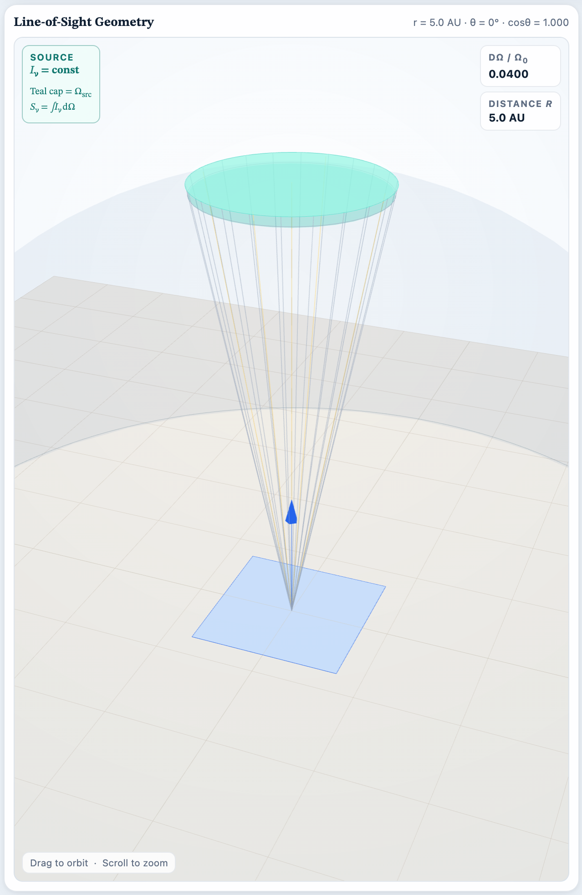
    <figcaption>Line-of-sight geometry</figcaption>
  </figure>
  <figure>
    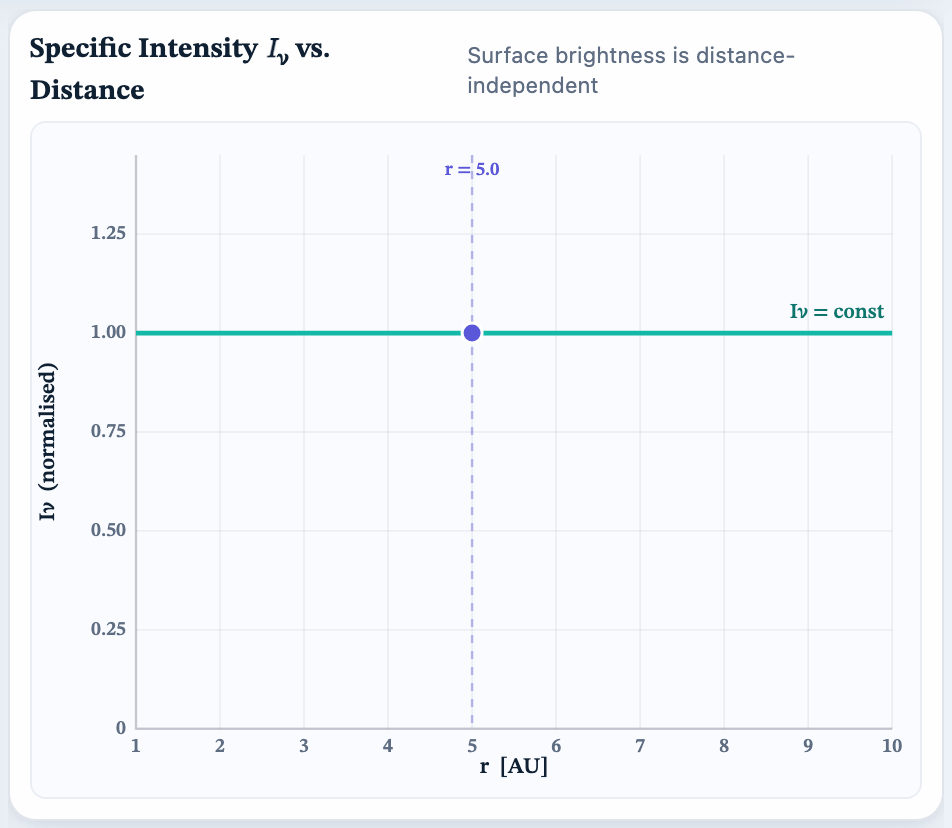
    <figcaption>Specific intensity vs. distance</figcaption>
  </figure>
  <figure>
    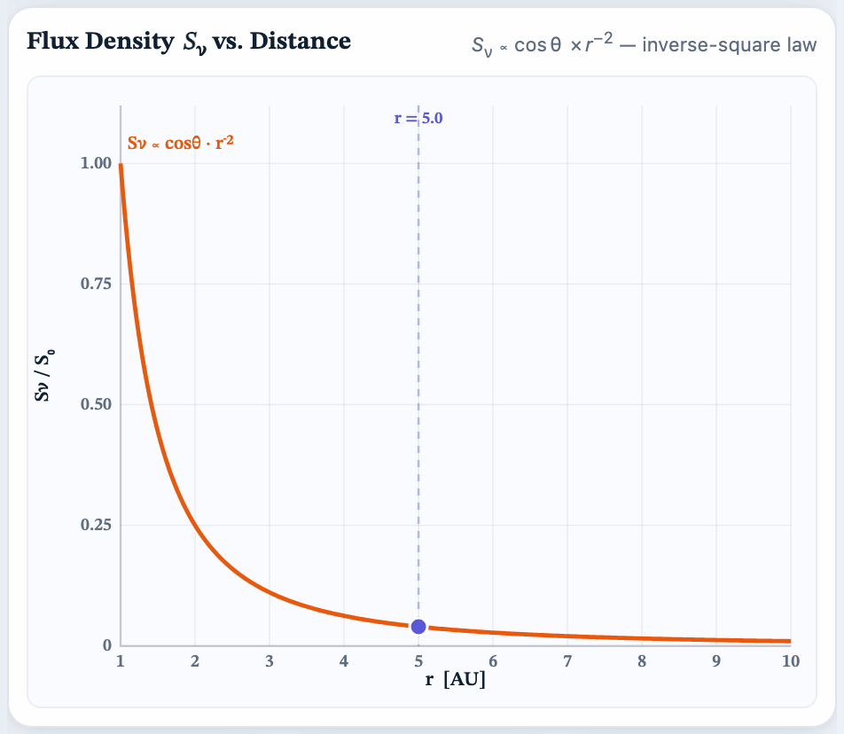
    <figcaption>Flux density vs. distance</figcaption>
  </figure>
</div>
```

The key distinction is between specific intensity and flux density. Specific intensity $I_\nu$ is surface brightness per unit solid angle. In empty space, with no absorption or scattering, it is conserved along a ray. Flux density $S_\nu$ is the integral of specific intensity over the solid angle subtended by the source:

$$
S_\nu
=
\int I_\nu(\theta,\phi)\cos\theta\,d\Omega .
$$

For a small resolved source with approximately uniform brightness, this reduces schematically to

$$
S_\nu \sim I_\nu \Omega_\mathrm{src}.
$$

As the source is moved farther away, the same physical area subtends a smaller solid angle, $\Omega_\mathrm{src}\propto r^{-2}$.  The specific intensity along each ray is unchanged, but the telescope receives radiation from a smaller patch of sky. That is why $I_\nu$ is distance-independent while $S_\nu$ falls like an inverse square.

The radio unit usually reported by observatories is the Jansky:

$$
1\ \mathrm{Jy}
=
10^{-26}\ \mathrm{W\,m^{-2}\,Hz^{-1}} .
$$

The blackbody reference intensity is the Planck function,

$$
B_\nu(T)
=
\frac{2h\nu^3}{c^2}
\frac{1}{\exp(h\nu/k_B T)-1}.
$$

This is a specific intensity: it has the same units as $I_\nu$ and describes the surface brightness of an optically thick thermal source at temperature $T$. In the radio limit,

The reason the Planck curve has a rising side and a falling side is a physical competition, not just a naming convention. At low frequency, each photon carries little energy, and the electromagnetic field has more available wave modes per unit frequency as $\nu$ increases. Moving to higher $\nu$ therefore opens more ways for the thermal radiation field to store energy, so the intensity rises. At high frequency, each photon costs an energy $h\nu$ that is large compared with the typical thermal energy $k_B T$. The material can still emit such photons, but only rare high-energy microscopic fluctuations can supply them, so the occupation of those modes falls rapidly. The peak occurs where the growing number of available modes is balanced by the decreasing probability of thermally populating a high-energy photon state.

$$
h\nu \ll k_B T,
\qquad
\exp(h\nu/k_B T)-1 \approx \frac{h\nu}{k_B T},
$$

so the Planck function becomes the Rayleigh--Jeans form

$$
B_\nu(T)
\approx
\frac{2k_B T\nu^2}{c^2}.
$$

The same explorer also introduces brightness temperature by inverting this Rayleigh--Jeans relation:

$$
T_B
=
\frac{c^2 I_\nu}{2k_B\nu^2},
$$

which is the temperature a blackbody would need in the Rayleigh--Jeans limit to have the measured specific intensity. It is a brightness unit, not automatically the kinetic temperature of the plasma. If the radiation is truly optically thick and thermal, then $I_\nu=B_\nu(T)$ and $T_B\simeq T$ in the radio limit. If the source is optically thin, nonthermal, coherent, or strongly beamed, $T_B$ is still useful as a reported brightness scale, but it should not be interpreted directly as a material temperature.

### How to Use `specific-intensity-flux-density.html`

Start with the default view. Point out the three linked representations: the 3D line-of-sight geometry, the flat $I_\nu$ versus distance plot, and the falling $S_\nu$ versus distance plot.

1. **Move the distance slider first.** Ask students to predict which curve changes. The intended answer is that $I_\nu$ stays fixed while $S_\nu$ falls because the source occupies a smaller solid angle.
2. **Change the source radius.** This changes the source solid angle at fixed distance, so the flux density changes even though the surface brightness remains fixed.
3. **Change the zenith angle.** Use this to motivate the projected-area factor $\cos\theta$ in the flux integral. This is a geometry effect, not an emission mechanism.
4. **End with brightness temperature.** Emphasize that $T_B$ follows $I_\nu$, not the total flux. This prepares students for the transfer explorer, where $T_B$ becomes the natural way to discuss optically thick and thin regimes.

The teaching phrase is: *specific intensity tells us how bright each ray is; flux density tells us how much of that brightness the telescope collects over the source's apparent solid angle.*

## Radio Transfer Mechanisms Explorer

### Transfer Summary

The [radio-transfer explorer](radio-transfer-mechanisms.html) comes after the radiometry explorer and before the emission mechanisms. It answers the question: how does a source's emissivity and opacity become the brightness temperature we observe?

**Assumptions and scope.** The displayed transfer solution is a scalar, one-dimensional, uniform-slab model. It neglects scattering, polarization coupling, spatial gradients inside the slab, and time dependence. Those omissions are deliberate: the panel isolates how $j_\nu$, $\kappa_\nu$, source function, background radiation, and optical depth control the observed brightness.

```{=latex}
\begin{center}
\gallerythumb{figures/explorer-screenshots/radio-transfer-line-of-sight.png}{Transfer line of sight}\hfill
\gallerythumb{figures/explorer-screenshots/radio-transfer-planck-spectrum.png}{Planck/source function}\hfill
\gallerythumb{figures/explorer-screenshots/radio-transfer-brightness-temperature.png}{Brightness temperature turnover}
\end{center}
```

```{=html}
<div class="explorer-gallery">
  <figure>
    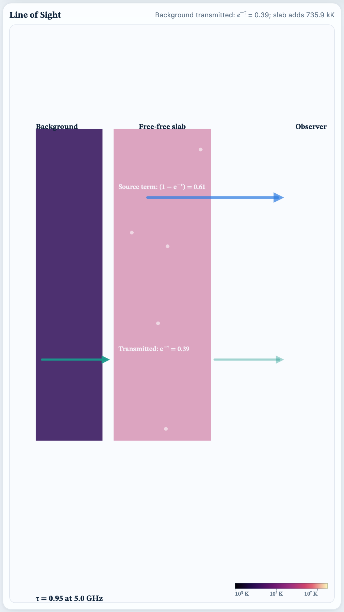
    <figcaption>Transfer line of sight</figcaption>
  </figure>
  <figure>
    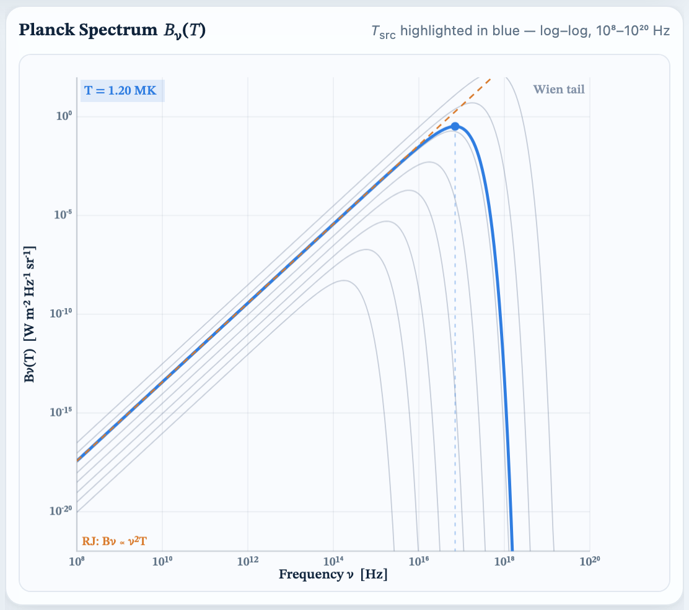
    <figcaption>Planck/source function</figcaption>
  </figure>
  <figure>
    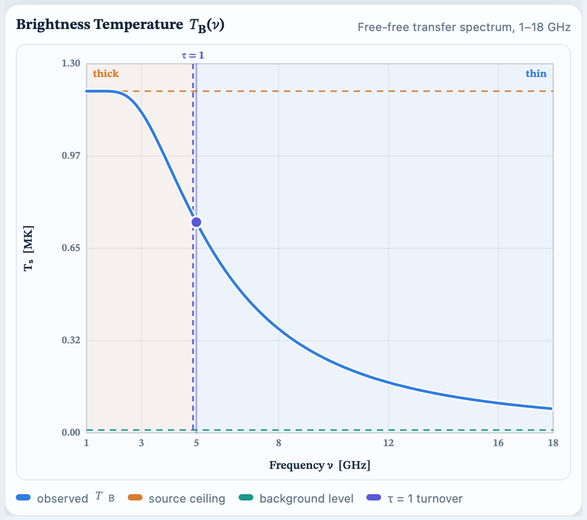
    <figcaption>Brightness temperature turnover</figcaption>
  </figure>
</div>
```

The starting point is the scalar radiative-transfer equation along a ray,

$$
\frac{dI_\nu}{dl}
=
j_\nu-\kappa_\nu I_\nu .
$$

Here $I_\nu$ is specific intensity, $j_\nu$ is the emission coefficient, and $\kappa_\nu$ is the absorption coefficient. The two terms have different meanings. The $j_\nu dl$ term adds locally produced radiation into the beam. The $\kappa_\nu I_\nu dl$ term removes a fraction of the radiation already in the beam. If the slab only absorbed, $j_\nu=0$, then

$$
dI_\nu=-\kappa_\nu I_\nu dl,
\qquad
I_\nu(L)=I_\nu(0)e^{-\int_0^L\kappa_\nu dl}.
$$

This motivates the optical depth

$$
\tau_\nu=\int_0^L \kappa_\nu dl .
$$

For a uniform emitting and absorbing slab, $j_\nu$ and $\kappa_\nu$ are constant. Define the source function

$$
S_\nu\equiv \frac{j_\nu}{\kappa_\nu}.
$$

Then

$$
\frac{d}{dl}\left(I_\nu-S_\nu\right)
=
-\kappa_\nu\left(I_\nu-S_\nu\right),
$$

so the difference between the intensity and the source function decays exponentially through the slab:

$$
I_{\nu,\mathrm{out}}
=
I_{\nu,\mathrm{bg}}e^{-\tau_\nu}
+
S_\nu\left(1-e^{-\tau_\nu}\right).
$$

In thermal equilibrium, emission and absorption balance, so $dI_\nu/dl=0$ and $I_\nu=j_\nu/\kappa_\nu=S_\nu$. Kirchhoff's law then gives $S_\nu=B_\nu(T_\mathrm{src})$. In the radio Rayleigh--Jeans limit, $I_\nu=2k_B\nu^2T_B/c^2$ and $B_\nu(T)=2k_B\nu^2T/c^2$. Dividing the intensity solution by the same Rayleigh--Jeans factor gives the displayed teaching equation for a uniform slab with background brightness temperature $T_\mathrm{bg}$ and source temperature $T_\mathrm{src}$:

$$
T_B
=
T_\mathrm{bg}e^{-\tau_\nu}
+
T_\mathrm{src}\left(1-e^{-\tau_\nu}\right).
$$

This is the formal transfer solution written in radio language. The first term is the background that survives absorption through the slab. The second term is the slab's own emission, weighted by how optically thick the slab is.

For free-free opacity, the explorer uses the scaling

$$
\tau_\mathrm{ff}
\propto
EM\,T^{-1.35}\nu^{-2.1},
$$

so low frequencies are more opaque than high frequencies. The turnover frequency where $\tau_\nu\sim 1$ is therefore a diagnostic bridge: below it the source is thick and $T_B$ approaches the source function; above it the source is thin and $T_B$ scales more directly with emission measure.

The Planck panel is included to keep the source function honest. In the radio limit $h\nu\ll kT$, the Planck spectrum becomes the Rayleigh--Jeans form, and brightness temperature is a convenient way to report intensity. At higher frequencies the full Planck curvature matters.

### How to Use `radio-transfer-mechanisms.html`

Use this immediately after the flux-density explorer.

1. **Start with the $\tau\sim 1$ preset.** Show that the selected observing frequency sits near the most diagnostic part of the spectrum, where neither the background nor the source completely dominates.
2. **Toggle background on and off.** With background included, students can see absorption and emission in one expression. With source-only, the transfer curve is easier to read as $T_\mathrm{src}(1-e^{-\tau})$.
3. **Use the thick slab preset.** Point out that increasing optical depth does not let $T_B$ grow without bound. The brightness saturates near the source function.
4. **Use the thin slab preset.** In the thin regime, $1-e^{-\tau}\approx\tau$, so the observed brightness is proportional to opacity and emission measure.
5. **Move frequency.** This makes the low-frequency thick side and high-frequency thin side visually obvious.
6. **Change EM and $T_\mathrm{src}$.** EM mainly moves the turnover through opacity; $T_\mathrm{src}$ changes the ceiling that thick emission approaches.

The teaching phrase is: *emission mechanisms tell us what creates radiation; transfer tells us how much of that radiation survives and what brightness temperature the observer reports.*

## Magnetoionic Propagation Explorer

### Propagation Summary

The [magnetoionic propagation explorer](magnetoionic-propagation.html) comes after radiative transfer and before the emission-mechanism sections. It answers the escape question: even if a mechanism generates an electromagnetic wave, can that wave propagate through the surrounding magnetized plasma?

**Assumptions and scope.** The refractive-index curves use the cold, collisionless, locally homogeneous Appleton--Hartree approximation with immobile ions. This is the right first model for x- and o-mode escape, cutoff, and stopband intuition, but it does not include finite temperature, density gradients, mode coupling through quasi-transverse layers, collisions, or full ray tracing.

```{=latex}
\begin{center}
\gallerythumb{figures/explorer-screenshots/magnetoionic-wave-propagation.png}{Magnetoionic wave view}\hfill
\gallerythumb{figures/explorer-screenshots/magnetoionic-refractive-index.png}{Refractive-index branches}\hfill
\gallerythumb{figures/explorer-screenshots/magnetoionic-polarization-state.png}{Polarization state}
\end{center}
```

```{=html}
<div class="explorer-gallery">
  <figure>
    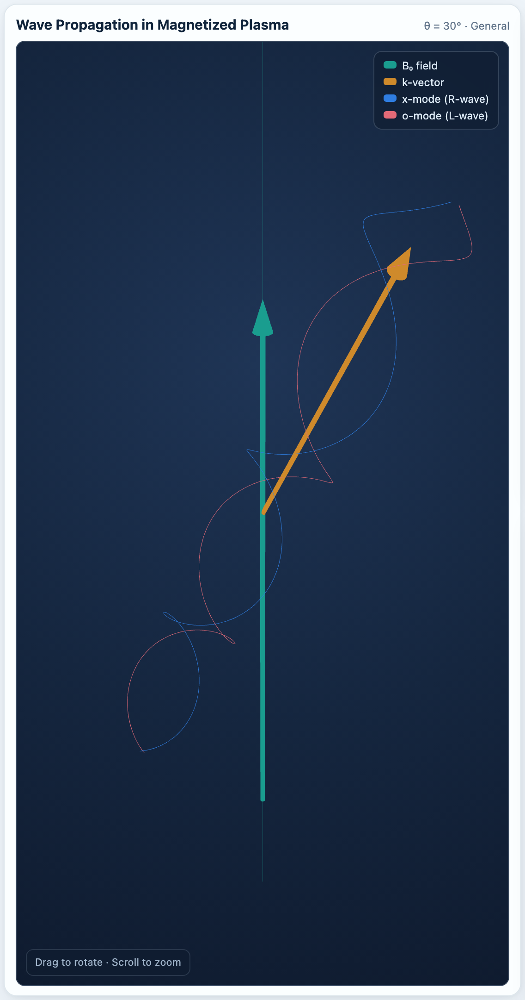
    <figcaption>Magnetoionic wave view</figcaption>
  </figure>
  <figure>
    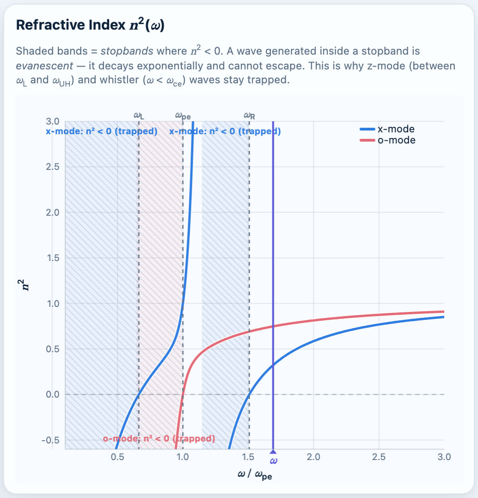
    <figcaption>Refractive-index branches</figcaption>
  </figure>
  <figure>
    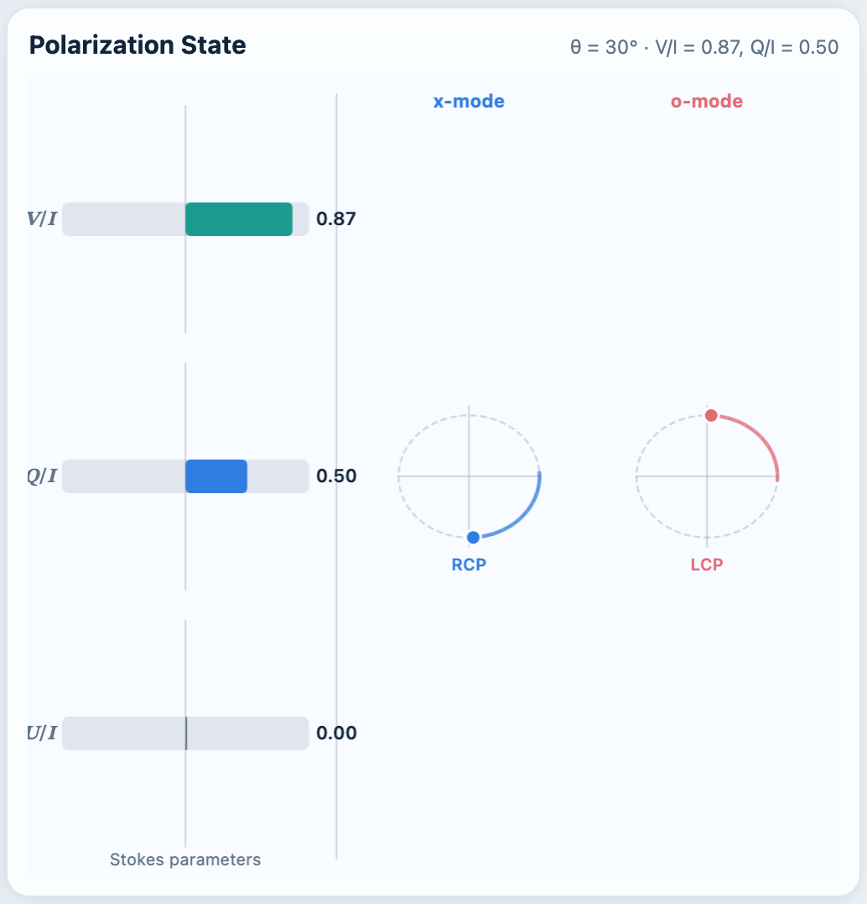
    <figcaption>Polarization state</figcaption>
  </figure>
</div>
```

The cold-plasma controls are written in terms of

$$
X = \frac{\omega_{pe}^2}{\omega^2},
\qquad
Y = \frac{\omega_{ce}}{\omega},
\qquad
\theta = \angle(\mathbf{k},\mathbf{B}_0).
$$

The dispersion relation is usually written through the refractive index,

$$
n^2 \equiv \frac{k^2c^2}{\omega^2}.
$$

For a cold electron plasma with immobile ions, the explorer uses the Appleton--Hartree form

$$
n^2
=
1 -
\frac{2X(1-X)}
{2(1-X)-Y_T^2 \mp D},
$$

with

$$
D
=
\left[
Y_T^4 + 4Y_L^2(1-X)^2
\right]^{1/2},
\qquad
Y_T = Y\sin\theta,
\qquad
Y_L = Y\cos\theta.
$$

The two signs give the two electromagnetic magnetoionic branches. In the convention used by the HTML, the lower-sign denominator,

$$
2(1-X)-Y_T^2-D,
$$

is plotted as the extraordinary or x-mode branch, while the upper-sign denominator,

$$
2(1-X)-Y_T^2+D,
$$

is plotted as the ordinary or o-mode branch. The formula is just the cold-plasma wave equation after the electron current response has been inserted into Maxwell's equations. The magnetic field makes the dielectric response anisotropic, so the transverse part of the gyro term, $Y_T$, and the longitudinal part, $Y_L$, enter differently.

The explorer emphasizes the physical consequence of the dispersion relation. If $n^2>0$, then $k$ is real and the wave can propagate. If $n^2<0$, then $k$ is imaginary and the wave is evanescent:

$$
k = i\kappa,
\qquad
E \propto e^{-\kappa s}.
$$

That is the mathematical meaning of a stopband. A mode can be generated locally inside the plasma and still fail to reach the observer if its frequency and propagation angle place it in a region where the Appleton--Hartree expression gives $n^2<0$.

The x- and o-modes are the escaping electromagnetic branches most relevant for solar radio observations. Other branches, such as z-mode and whistler-like waves, may exist inside the plasma but are trapped in stopbands or below cutoffs. This distinction is essential for plasma emission and ECM: growth in the source region is not the same as observability at Earth.

The polarization panel connects propagation to Stokes diagnostics. Changing $\theta_{kB}$ moves the problem between quasi-longitudinal and quasi-transverse limits. The same plasma can produce different polarization states depending on viewing geometry and mode.

### How to Use `magnetoionic-propagation.html`

Use this after transfer and before the emission-mechanism sections.

1. **Begin with the QL propagating preset.** Students should see x- and o-mode waves propagate with distinct polarization states. Connect this to ordinary and extraordinary radio modes.
2. **Move $\theta_{kB}$.** Show how polarization changes between more circular in the quasi-longitudinal case and more linear/elliptical near quasi-transverse propagation.
3. **Increase $X=\omega_{pe}^2/\omega^2$.** This raises the plasma loading. Watch the refractive-index plot and the regime readout. The conceptual point is that high density pushes waves toward cutoff.
4. **Change $Y=\omega_{ce}/\omega$.** This changes the importance of the magnetic field and separates the x- and o-mode behavior.
5. **Use the z-mode trap preset.** This is the most important escape lesson: a wave can be physically present in the source plasma but still be invisible to a remote observer if it lies in a trapped or evanescent branch.
6. **Return to ECM or plasma emission.** Ask: does the mechanism make a wave on an escaping branch, or does it first make a trapped electrostatic or magnetoionic mode that needs conversion?

The teaching phrase is: *generation is local, but observation requires escape.*

## Bremsstrahlung Explorer

### Mechanism Summary

Bremsstrahlung is radiation from Coulomb acceleration. An electron passing an ion is deflected by the ion's electric field, so each encounter emits a small acceleration pulse. A plasma contains many such encounters with many impact parameters and electron speeds, so the summed emission is a continuum. The word "free-free" means that the electron is free before and after the encounter.

This explorer is the clean non-magnetic contrast case. The magnetic field does not set the frequency. There is no wave-particle resonance analogous to Langmuir growth or ECM. The controls are the ion charge $Z$, electron speed $v$, impact parameter $b$, temperature $T_e$, and emission measure.

**Assumptions and scope.** The single-encounter picture is classical and nonrelativistic. The thermal emissivity and opacity scalings are radio-limit free-free approximations with the Gaunt factor treated as a slowly varying correction. They are suitable for teaching how continuum emission and optical-depth turnover work; precision modeling should use tabulated or numerically evaluated Gaunt factors and the full plasma composition.

### Section A: One Close Encounter

```{=latex}
\explorerthumb{figures/explorer-screenshots/bremsstrahlung-close-encounter.png}{Section A: close encounter}
```

```{=html}
<figure class="explorer-thumb">
  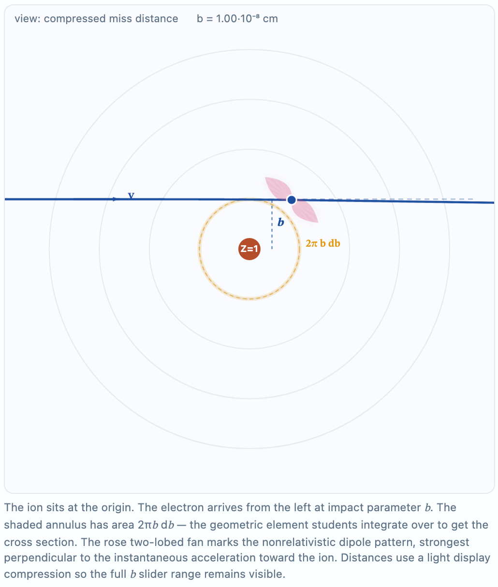
  <figcaption>Section A: close encounter</figcaption>
</figure>
```

The single-encounter panel shows the microscopic event. The ion sits at the origin and the electron arrives with impact parameter $b$. The Coulomb force bends the trajectory, with a characteristic small-angle deflection

$$
\tan\frac{\Theta}{2}
=
\frac{Z e^2}{m_e v^2 b}.
$$

This formula explains the explorer controls directly:

$$
\hbox{larger } Z \rightarrow \hbox{stronger deflection},
\qquad
\hbox{smaller } b \rightarrow \hbox{stronger deflection},
\qquad
\hbox{slower } v \rightarrow \hbox{stronger deflection}.
$$

The radiation is strongest near closest approach, where the acceleration is largest. The rose two-lobed pattern is the nonrelativistic dipole radiation pattern: the instantaneous radiation is strongest perpendicular to the acceleration.

### Section A Spectrum: Encounter Time and Cutoff

```{=latex}
\explorerthumb{figures/explorer-screenshots/bremsstrahlung-encounter-spectrum.png}{Section A: encounter spectrum}
```

```{=html}
<figure class="explorer-thumb">
  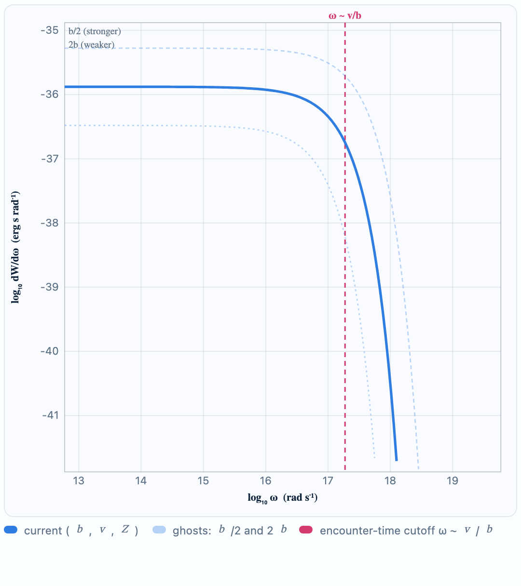
  <figcaption>Section A: encounter spectrum</figcaption>
</figure>
```

The formula box shows the approximate single-collision spectrum

$$
\frac{dW}{d\omega}
\asymp
\frac{8 Z^2 e^6}
{3\pi c^3 m_e^2 v^2 b^2}
$$

in the low-frequency limit

$$
\frac{\omega b}{v}\ll 1.
$$

The reason is time scale. The acceleration pulse lasts for an encounter time of order

$$
\tau_\mathrm{enc} \sim \frac{b}{v}.
$$

Fourier components with periods long compared with this pulse see the encounter as impulsive and have an approximately flat spectrum. Components with frequencies above the inverse encounter time are suppressed:

$$
\omega_{\max}\sim \frac{v}{b}.
$$

Thus smaller impact parameter does two things at once: it strengthens the acceleration and extends the spectrum to higher frequency.

### Section B: Thermal Free-Free Emissivity

```{=latex}
\explorerthumb{figures/explorer-screenshots/bremsstrahlung-thermal-emissivity.png}{Section B: emissivity}
```

```{=html}
<figure class="explorer-thumb">
  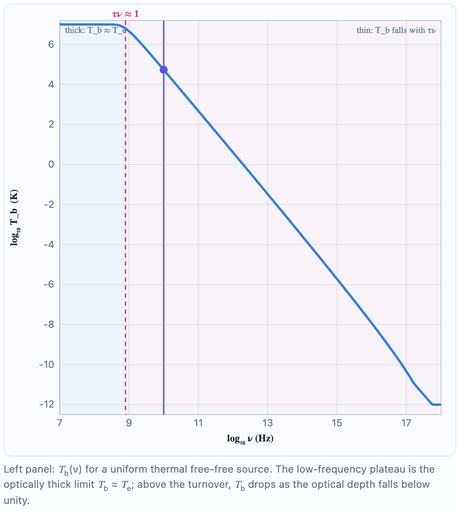
  <figcaption>Section B: emissivity</figcaption>
</figure>
```

For a thermal plasma, one integrates over a Maxwellian velocity distribution and over impact parameters. The standard optically thin scaling is

$$
\epsilon_\nu
\propto
Z^2 n_e n_i T^{-1/2}
\exp\left(-\frac{h\nu}{kT}\right)
g_{ff},
$$

where $g_{ff}$ is the Gaunt factor. The exponential cutoff is important at photon energies comparable to or above the thermal electron energy. In the radio limit,

$$
h\nu \ll kT,
$$

the exponential is nearly one, so the optically thin emissivity is only weakly frequency dependent apart from the Gaunt factor.

The emission measure control represents the line-of-sight integral

$$
EM = \int n_e n_i\, ds
$$

up to the conventions used in the radio approximation. Increasing $EM$ increases the opacity and the emitted flux because there are more electron-ion encounters along the line of sight.

### Section B: Thick-Thin Radio Transfer

```{=latex}
\explorerthumb{figures/explorer-screenshots/bremsstrahlung-thick-thin-transfer.png}{Section B: thick-thin transfer}
```

```{=html}
<figure class="explorer-thumb">
  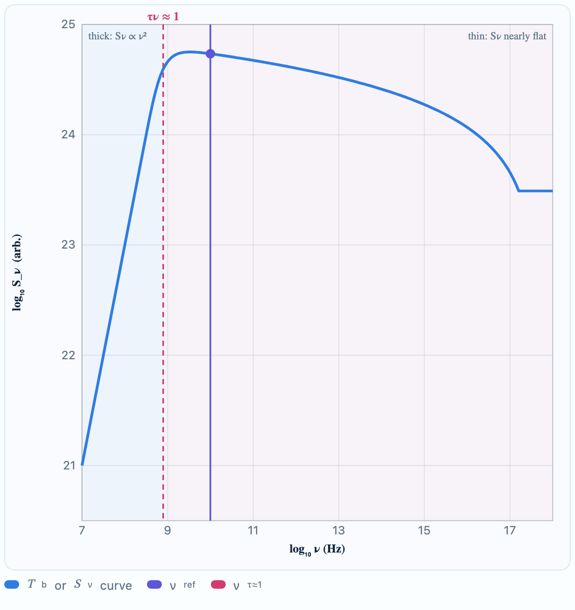
  <figcaption>Section B: thick-thin transfer</figcaption>
</figure>
```

The Dulk-style panel emphasizes radio transfer rather than only local emissivity. The explorer uses the approximate optical-depth scaling

$$
\tau_\nu
\propto
Z^2\,EM\,T^{-3/2}\,\nu^{-2}\,g_{ff,\mathrm{radio}}.
$$

Brightness temperature is then plotted as

$$
T_b(\nu) = T_e\left(1-e^{-\tau_\nu}\right).
$$

This produces two simple limits:

$$
\tau_\nu \gg 1:
\quad
T_b \rightarrow T_e,
$$

and

$$
\tau_\nu \ll 1:
\quad
T_b \approx T_e \tau_\nu .
$$

For a fixed source area, the flux proxy follows the Rayleigh-Jeans scaling

$$
S_\nu \propto \nu^2 T_b.
$$

Therefore the low-frequency optically thick side rises approximately as $\nu^2$, while the high-frequency optically thin radio side is much flatter. The turnover marker is the frequency where

$$
\tau_\nu \approx 1.
$$

That turnover is a transfer effect. It should not be confused with the cyclotron frequency, plasma frequency, or a maser resonance.

#### Free-Free HTML Narrative for `bremsstrahlung-explorer.html`

Use the free-free explorer as the nonresonant endpoint of the emission-mechanism sequence. The narrative should keep returning to one idea: individual Coulomb encounters make short acceleration pulses, while the source spectrum comes from summing many such pulses through thermal emission and transfer.

1. **Panel A: encounter geometry.** The trajectory is a Coulomb scattering event. The ion charge $Z$ sets the strength of the acceleration, the impact parameter $b$ sets how close and how short the encounter is, and the electron speed $v$ controls both the deflection angle and the encounter time. This panel should be read as a single microscopic event, not as a wave-growth diagram.

2. **Panel A spectrum: one pulse in frequency space.** A single encounter has an acceleration pulse of duration $\tau_\mathrm{enc}\sim b/v$. Fourier components below $\omega\sim v/b$ see a short impulse and give an approximately flat low-frequency spectrum. Higher-frequency components are suppressed because they try to resolve structure shorter than the encounter time. Smaller $b$ therefore makes the pulse both stronger and broader in frequency.

3. **Panel B emissivity: many encounters.** Thermal free-free emissivity is obtained by summing the single-encounter radiation over Maxwellian electron speeds and over impact parameters. That is why the formula depends on $Z^2 n_e n_i$, $T_e$, and the Gaunt factor rather than on one selected resonance frequency.

4. **Panel B transfer: why the radio spectrum turns over.** The displayed radio turnover is caused by absorption and transfer. At low frequency $\tau_\nu$ is large, so $T_b$ approaches $T_e$ and the flux proxy rises roughly like the Rayleigh-Jeans factor $\nu^2$. At high frequency the source is optically thin, so $T_b\approx T_e\tau_\nu$.

### Bremsstrahlung Preset Narratives

**Ion charge presets.**  
Use H, He, C, and Fe to show the $Z^2$ dependence. This is a charge-squared effect in the acceleration, not a change in the electron distribution.

**Temperature sweep.**  
Use this to connect thermal speed, high-frequency cutoff, and radio opacity. Higher $T_e$ gives faster electrons and changes both the emissivity scale and the optical-depth normalization.

**Emission-measure sweep.**  
Use this to show how density column changes the turnover. Larger $EM$ moves the $\tau_\nu\approx1$ transition to higher frequency and raises the flux proxy.

## Gyro Emission Explorer

### Mechanism Summary

The gyro-emission explorer is the incoherent magnetic-emission comparison case. A charged particle moving in a magnetic field accelerates because the Lorentz force bends the perpendicular part of its velocity, and that acceleration radiates. At low energy the emission is cyclotron-like: power appears near the electron cyclotron frequency and its first few harmonics. At mildly relativistic energy the beaming and harmonic structure broaden into gyrosynchrotron emission. At high Lorentz factor the radiation is strongly forward beamed and the many harmonics merge into the familiar synchrotron continuum.

- **Gyro emission:** ordinary radiation from accelerated charges.
- **ECM:** wave growth from velocity-space free energy.

**Assumptions and scope.** The single-electron panels show vacuum gyro/synchrotron radiation in a uniform magnetic field. The ensemble panel uses simplified thermal or power-law distributions and pedagogical opacity/Razin controls. The synchrotron absorption exponents are exact only in the ideal ultrarelativistic power-law limit; the Dulk--Marsh gyrosynchrotron approximation is empirical and valid only over its stated harmonic, viewing-angle, and electron-index range.

### Panel A: Single Electron in a Uniform Magnetic Field

```{=latex}
\explorerthumb{figures/explorer-screenshots/gyro-single-electron-beam.png}{Panel A: single electron}
```

```{=html}
<figure class="explorer-thumb">
  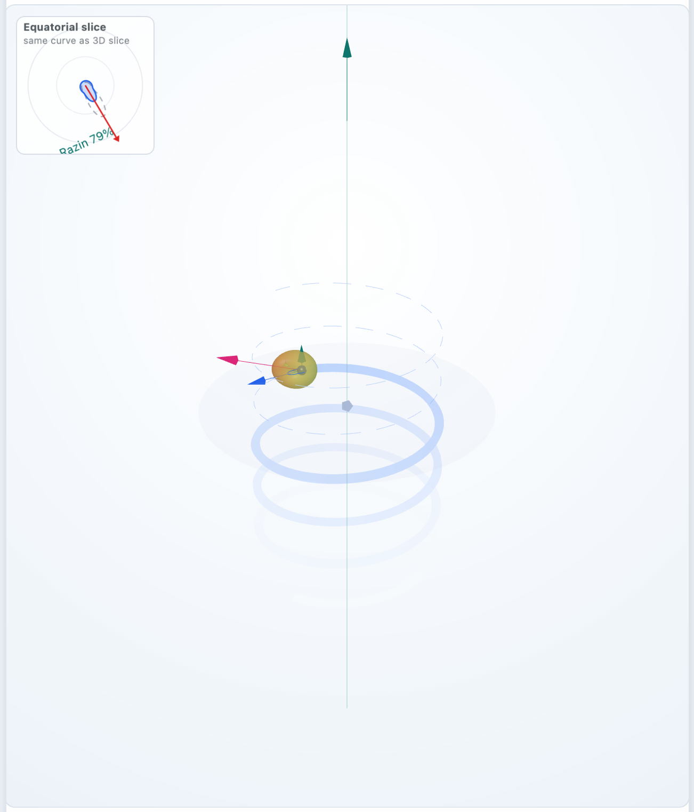
  <figcaption>Panel A: single electron</figcaption>
</figure>
```

The top panel answers the most basic question: why does a magnetized electron radiate at all? Split the velocity into components parallel and perpendicular to the magnetic field,

$$
v^2 = v_\parallel^2 + v_\perp^2.
$$

The parallel component streams along the field. The perpendicular component executes circular motion at the relativistic gyrofrequency

$$
\Omega_{ce,\mathrm{rel}} = \frac{\Omega_{ce}}{\gamma},
\qquad
\Omega_{ce} = \frac{eB}{m_e c},
$$

so the pitch angle controls the amount of transverse acceleration:

$$
v_\perp = v \sin\alpha,
\qquad
v_\parallel = v \cos\alpha .
$$

For nonrelativistic motion, the observer sees a rotating dipole pattern tied to the instantaneous acceleration. As $\gamma$ increases, aberration compresses the apparent radiation into a narrower forward cone around the electron velocity. The explorer's $\gamma$ slider is therefore not just an energy slider. It changes the emission geometry: cyclotron-like dipole radiation becomes gyrosynchrotron-like beaming, and then synchrotron-like searchlight emission.

The magnetic-field slider sets the frequency scale:

$$
\nu_{ce} = \frac{\Omega_{ce}}{2\pi} \approx 2.8\,B\ \mathrm{MHz}
$$

when $B$ is measured in gauss. Increasing $B$ moves the same physical pattern to higher frequency.

### Panel B: Observer Light Curve and Viewing Direction

```{=latex}
\explorerthumb{figures/explorer-screenshots/gyro-observer-signal.png}{Panel B: observer signal}
```

```{=html}
<figure class="explorer-thumb">
  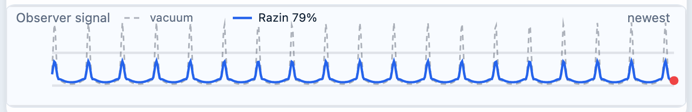
  <figcaption>Panel B: observer signal</figcaption>
</figure>
```

The camera direction in the 3D panel is the far-field line of sight. The light curve below the orbit is the observer's received power as the beamed pattern sweeps past that line of sight. In the low-$\gamma$ limit the beam is broad, so the modulation is gentle. In the relativistic limit the beam has angular width of order

$$
\Delta\theta \sim \frac{1}{\gamma},
$$

so the observer sees short pulses when the velocity vector points close to the line of sight.

The pitch angle and viewing angle are different quantities. The pitch angle $\alpha$ is the angle between the electron velocity and $\mathbf{B}$. The observer angle $\theta_\mathrm{obs}$ is the angle between the line of sight and $\mathbf{B}$. Emission is strongest when the gyrating velocity cone sweeps across the observer. This is why changing the camera can change the displayed light curve without changing the underlying particle energy or magnetic field.

### Panel C: Single-Electron Spectrum

```{=latex}
\explorerthumb{figures/explorer-screenshots/gyro-single-electron-spectrum.png}{Panel C: single-electron spectrum}
```

```{=html}
<figure class="explorer-thumb">
  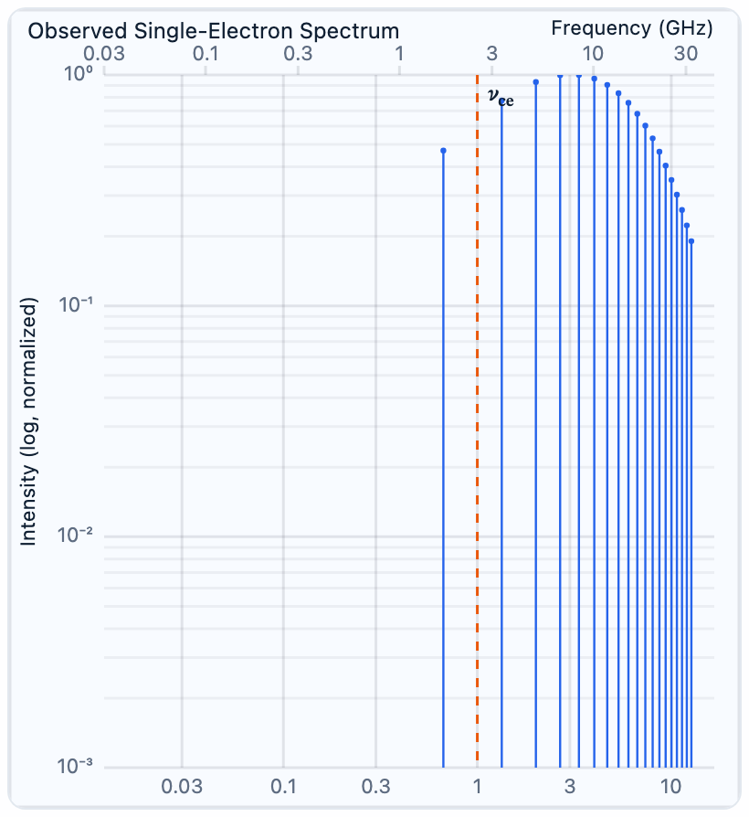
  <figcaption>Panel C: single-electron spectrum</figcaption>
</figure>
```

The single-electron spectrum panel gives the bridge from orbit geometry to frequency content. The key point is that one electron is not radiating a thermal continuum. It is executing a periodic orbit, so the frequency content comes from the Fourier content of the received acceleration pattern.

In the nonrelativistic cyclotron limit, the electron acceleration is almost a pure sinusoid at the gyrofrequency. A pure sinusoid has one Fourier frequency, so the spectrum is dominated by the fundamental and the harmonics are absent or extremely weak in the simplified teaching picture. This is why the low-$\gamma$ spectrum can look like one main cyclotron line rather than a comb.

Harmonics appear when the received signal is no longer a simple sinusoid. Mild relativistic motion changes the radiation pattern through aberration, light-travel-time effects, and beaming. The observer receives a more pulse-like waveform once per gyro-orbit, and a pulse train has Fourier power at integer multiples of the orbital frequency. Schematically,

$$
\nu_s \sim s\,\nu_{ce,\mathrm{rel}},
\qquad
s = 1,2,3,\ldots .
$$

Here $\nu_{ce,\mathrm{rel}}=\nu_{ce}/\gamma$ is the relativistic gyrofrequency of the orbit. Increasing $\gamma$ therefore does two things at once. It lowers the spacing of the harmonic ladder through the slower relativistic gyration, but it also makes the radiation much more forward-beamed.

The reason the envelope peak moves to high harmonic number is that the observer no longer receives a smooth sinusoidal signal over the whole orbit. Relativistic aberration confines most of the radiation to a cone of angular width $\sim 1/\gamma$ around the instantaneous velocity. The observer sees emission only during the short part of the gyro-orbit when that cone sweeps across the line of sight. A narrower pulse in orbital phase requires higher Fourier harmonics to represent it. More detailed synchrotron theory gives a characteristic contributing harmonic of order

$$
s_\mathrm{char}\sim \gamma^3\sin\theta_\mathrm{obs},
$$

up to factors of order unity. Multiplying this harmonic number by the relativistically reduced orbital frequency gives

$$
\nu_\mathrm{char}
\sim
s_\mathrm{char}\,\nu_{ce,\mathrm{rel}}
\sim
\left(\gamma^3\sin\theta_\mathrm{obs}\right)
\frac{\nu_{ce}}{\gamma}
\sim
\gamma^2\nu_{ce}\sin\theta_\mathrm{obs}.
$$

Thus the harmonic spacing becomes smaller as $1/\gamma$, but the power shifts to much larger harmonic number, so the observable characteristic frequency grows roughly as

$$
\nu_\mathrm{syn} \sim \gamma^2 \nu_B \sin\theta_\mathrm{obs},
$$

as shown in the explorer. The exact numerical coefficient depends on whether one is quoting the critical frequency, the peak of $\nu P_\nu$, or a viewing-angle-specific approximation. At high $\gamma$, so many harmonics contribute that individual lines blur into a synchrotron-like continuum.

The teaching scalings are:

- higher $B$ moves the whole spectrum to higher frequency because $\nu_{ce}\propto B$;
- higher $\gamma$ shifts power to many higher harmonics and raises the characteristic synchrotron-like frequency roughly as $\gamma^2$;
- larger transverse motion gives stronger magnetic radiation because $v_\perp$ sets the curvature acceleration.

### Panel D: Ensemble Spectrum

```{=latex}
\explorerthumb{figures/explorer-screenshots/gyro-ensemble-spectrum-razin.png}{Panel D: ensemble spectrum}
```

```{=html}
<figure class="explorer-thumb">
  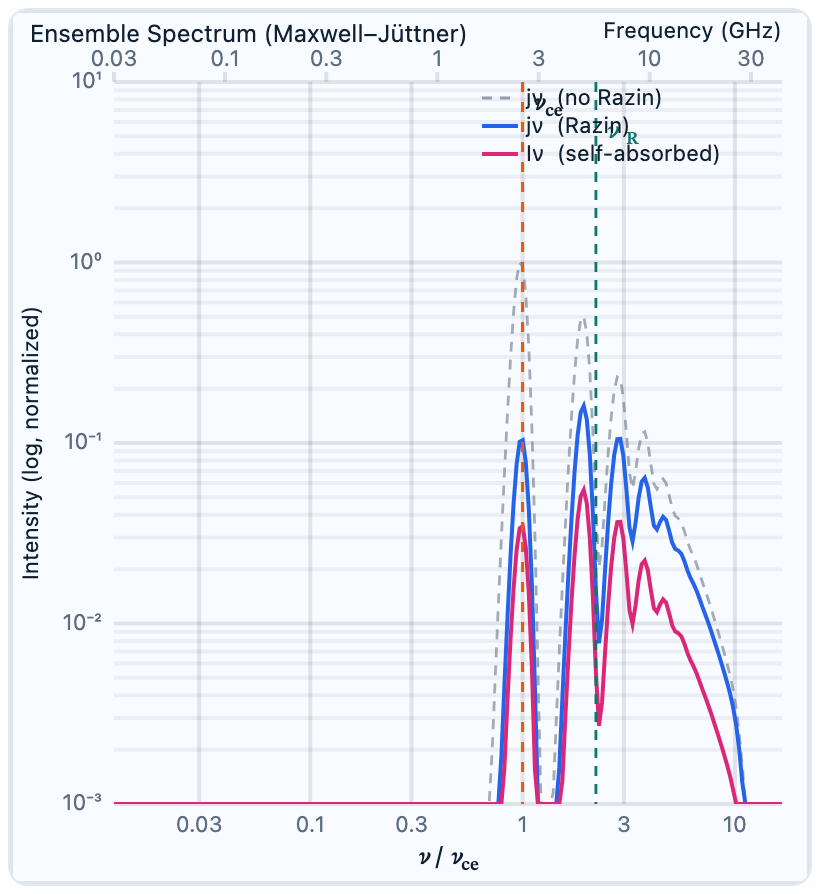
  <figcaption>Panel D: ensemble spectrum</figcaption>
</figure>
```

The lower spectrum panel answers the question: what changes when the source contains many electrons rather than one? The single-electron spectrum $P_\nu(\gamma,\alpha)$ is the building block. The ensemble emissivity is a weighted sum over electron energy and pitch angle,

$$
j_\nu
\sim
\int d\gamma\,d\alpha\,
N(\gamma,\alpha)\,
P_\nu(\gamma,\alpha;B,\theta_\mathrm{obs}) .
$$

This integral is why the ensemble spectrum is smoother than the single-electron spectrum. Each value of $\gamma$ and $\alpha$ places the harmonic pattern or synchrotron-like envelope at a slightly different frequency. Adding many electrons smears the individual harmonic features and leaves the broad spectral shape set by the distribution function.

- **Thermal distribution.** A thermal population has a characteristic dimensionless temperature $\theta_e=kT/(m_e c^2)$ and many more low-energy electrons than high-energy electrons. The resulting spectrum is broad but comparatively soft: low and mildly relativistic electrons dominate, and the high-frequency side drops rapidly because the Maxwellian tail is sparse.

- **Power-law distribution.** A nonthermal population has $N(\gamma)\,d\gamma \propto \gamma^{-\delta}\,d\gamma$ between $\gamma_{\min}$ and $\gamma_{\max}$. It keeps more high-energy electrons than a thermal distribution, so it produces a broader high-frequency tail. A smaller $\delta$ means a flatter electron spectrum and therefore more high-frequency radiation.

The controls $\gamma_{\min}$, $\gamma_{\max}$, and $\delta$ should be interpreted as controls on which Lorentz factors are available to radiate, not as a change in the single-particle radiation law.

#### Why Gyrosynchrotron Spectra Have Optically Thick and Thin Sides

The broad peak in a gyrosynchrotron spectrum is usually not just the frequency where one electron radiates most strongly. It is also a radiative-transfer turnover. The same magnetized electron population that emits gyrosynchrotron radiation also absorbs it. For a uniform source of depth $L$,

$$
I_\nu
=
\frac{j_\nu}{\kappa_\nu}
\left(1-e^{-\kappa_\nu L}\right)
=
S_\nu\left(1-e^{-\tau_\nu}\right),
\qquad
\tau_\nu=\kappa_\nu L .
$$

Here $j_\nu$ is the emissivity, $\kappa_\nu$ is the absorption coefficient, and $S_\nu=j_\nu/\kappa_\nu$ is the source function. The reason $\kappa_\nu$ is largest on the low-frequency side is that absorption is the inverse of emission. A photon can be absorbed only if an electron can take its energy and momentum and move to a slightly higher gyro-orbit or synchrotron-emitting state. Low-frequency photons require only a small energy change, so many low- and mildly relativistic electrons in the distribution can participate. Those same electrons are numerous, so the probability per unit path length for reabsorption is large.

High-frequency photons are harder to absorb. They correspond to high harmonics or to radiation from higher-$\gamma$ electrons, so an absorbing electron must already be energetic enough to resonate with that part of the spectrum. In a thermal distribution such electrons are exponentially rare; in a power-law distribution they are still much less numerous than low-energy electrons. Thus the absorption coefficient falls with frequency, even while individual high-energy electrons may emit efficiently at high frequency.

In the ideal ultrarelativistic synchrotron limit, this statement becomes a simple scaling. For a power-law electron distribution

$$
N(\gamma)\,d\gamma = K\gamma^{-\delta}\,d\gamma,
$$

the synchrotron absorption coefficient scales as

$$
\kappa_\nu
\propto
K\,
B^{(\delta+2)/2}\,
\nu^{-(\delta+4)/2}.
$$

For a common flare value $\delta=3$, this gives $\kappa_\nu\propto\nu^{-3.5}$: self-absorption is very strong at low frequency and rapidly weakens at high frequency. The frequency dependence appears because a given observing frequency mainly samples electrons with a characteristic Lorentz factor

$$
\gamma_\nu
\sim
\left(\frac{\nu}{\nu_B\sin\alpha}\right)^{1/2}.
$$

Increasing $\nu$ therefore selects larger $\gamma_\nu$. Since the electron distribution decreases with energy, there are fewer electrons available to absorb those photons. The same expression also explains why the turnover frequency depends on magnetic field. At fixed observing frequency, increasing $B$ increases $\nu_B$ and lowers the required $\gamma_\nu$. The photon is then coupled to more numerous, lower-energy electrons, and the absorption coefficient at that frequency increases.

The physical picture is that a radio photon at frequency $\nu$ does not interact equally with all electrons. It mainly interacts with the part of the distribution whose gyro/synchrotron characteristic frequency is near $\nu$. At low $\nu$, that selected part of the distribution lies at low $\gamma$, where there are many electrons, so photons are easily reabsorbed before leaving the source. At high $\nu$, the selected part lies farther out on the energetic tail, where there are fewer electrons, so the source becomes transparent.

Changing $B$ moves this selection through the electron distribution. A stronger magnetic field raises the gyrofrequency of every electron. The same observing frequency can then be produced or absorbed by lower-energy electrons, or by a lower effective harmonic number, than it could in a weaker field. Because lower-energy electrons are more abundant, the opacity at that observing frequency increases. A frequency that was optically thin at weak $B$ can therefore become optically thick at stronger $B$.

This is the physical reason the turnover is associated with $B$. The turnover is the frequency where the selected absorbing population has just enough column density to give optical depth of order one. If $B$ is increased, the "many-electron" part of the distribution is shifted to higher radio frequency, so the $\tau_\nu\sim1$ crossing also shifts upward.

The turnover frequency is defined approximately by

$$
\tau_{\nu_t}
=
\kappa_{\nu_t}L
\sim 1 .
$$

Using the ideal synchrotron scaling above,

$$
\nu_t
\propto
\left(KL\right)^{2/(\delta+4)}
B^{(\delta+2)/(\delta+4)} .
$$

For $\delta=3$, this gives $\nu_t\propto B^{5/7}$, apart from pitch-angle and geometry factors. The exact exponent is not the teaching point. The important point is that stronger $B$ both shifts the single-electron frequency scale upward and makes the source more opaque at a fixed low radio frequency, so the $\tau_\nu\sim1$ crossing moves to higher frequency.

The additional powers of $\nu$ and $B$ come from the synchrotron radiation kernel and from the fact that true absorption is the imbalance between upward photon absorption and downward stimulated emission; that imbalance depends on the slope of the electron distribution, not only on the number of electrons.

For mildly relativistic gyrosynchrotron emission, the same physical trend holds but the exponent is not universal because the radiation is still organized by finite gyro-harmonics. A commonly used Dulk--Marsh approximation for an isotropic nonthermal power-law distribution, valid roughly for harmonic number $\nu/\nu_B\sim 10$--$100$, viewing angle $20^\circ$--$80^\circ$, and $\delta\sim 2$--$7$, gives

$$
\frac{\kappa_\nu B}{N}
\propto
\left(\frac{\nu}{\nu_B}\right)^{-(1.30+0.98\delta)},
$$

or, since $\nu_B\propto B$,

$$
\kappa_\nu
\propto
N\,B^{0.30+0.98\delta}\,
\nu^{-(1.30+0.98\delta)}
$$

up to factors depending on $\delta$ and viewing angle. For $\delta=3$, this is approximately $\kappa_\nu\propto\nu^{-4.24}$, even steeper than the simple ultrarelativistic synchrotron scaling. The exact slope can change near low harmonics, for thermal electrons, for anisotropic pitch-angle distributions, or when Razin/refraction effects matter. The robust point is that increasing frequency corresponds to higher harmonic number and generally higher resonant electron energy; because the available electron population falls with energy, the absorption probability drops rapidly.

Setting $\kappa_{\nu_t}L\sim1$ in this gyrosynchrotron approximation gives

$$
\nu_t
\propto
\left(NL\right)^{1/(1.30+0.98\delta)}
B^{(0.30+0.98\delta)/(1.30+0.98\delta)} ,
$$

so for $\delta=3$ the magnetic-field exponent is about $0.76$. This is why a stronger magnetic field tends to move the gyrosynchrotron turnover to higher frequency even if the electron column is unchanged.

At low radio frequency the absorption coefficient is therefore large, so $\tau_\nu\gg 1$. The source is optically thick and the observed brightness approaches $S_\nu$, not the optically thin emissivity times the source depth. In this regime, adding more emitting particles mainly moves the $\tau_\nu\sim 1$ turnover rather than increasing the emergent brightness in direct proportion.

At high frequency the absorption coefficient becomes small, so $\tau_\nu\ll 1$ and

$$
I_\nu \simeq j_\nu L .
$$

This is the optically thin side. There the spectrum more directly traces the electron energy distribution: a thermal distribution falls rapidly at high frequency, while a power-law distribution leaves a broader high-frequency tail. In the same ideal synchrotron limit, the emissivity scales as $j_\nu\propto\nu^{-(\delta-1)/2}$. Combining this with the absorption scaling above gives

$$
S_\nu=\frac{j_\nu}{\kappa_\nu}\propto \nu^{5/2},
$$

so the thick side rises approximately as $I_\nu\simeq S_\nu\propto\nu^{5/2}$, while the thin side falls approximately as $I_\nu\simeq j_\nu L\propto\nu^{-(\delta-1)/2}$. Mildly relativistic gyrosynchrotron spectra are less clean because low harmonics, viewing angle, pitch-angle distribution, and thermal electrons all matter, but the physical division is the same: low-frequency emission is transfer-limited, high-frequency emission is emissivity-limited, and the turnover sits near $\tau_\nu\sim 1$.

#### Razin Suppression in Dense Plasma

The gyro-emission panels mainly show the vacuum single-particle radiation and the ensemble sum. In a real source, however, the wave is formed and then propagates inside a plasma. High density changes the electromagnetic refractive index before the radiation has fully separated from the electron. This is the origin of the Razin effect.

For a transverse electromagnetic wave above the plasma cutoff, a simple unmagnetized approximation gives

$$
n_\mathrm{ref}
\simeq
\left(1-\frac{\nu_{pe}^2}{\nu^2}\right)^{1/2},
\qquad
\nu_{pe}\approx 9.0\times 10^3\sqrt{n_e}\ \mathrm{Hz},
$$

with $n_e$ in $\mathrm{cm}^{-3}$. When $n_e$ is large, $\nu_{pe}$ is large, so $n_\mathrm{ref}$ becomes noticeably smaller than one at low radio frequency. The wave phase speed is then $v_\phi=c/n_\mathrm{ref}>c$. The electron and the wave slip in phase more quickly than they would in vacuum, so radiation from different parts of the gyro-orbit does not add coherently over the usual formation length.

For mildly relativistic gyrosynchrotron emission, the important comparison is between two angular scales. Vacuum beaming puts most of the radiation into an angle

$$
\Delta\theta_\mathrm{beam}\sim \frac{1}{\gamma}.
$$

Plasma refraction introduces an effective angular scale of order $\nu_{pe}/\nu$. Once

$$
\frac{\nu_{pe}}{\nu}
\gtrsim
\frac{1}{\gamma},
$$

the plasma strongly alters the beaming geometry and the low-frequency emissivity is suppressed. Using the approximate gyrosynchrotron scaling $\nu\sim\gamma^2\nu_{ce}$ gives the familiar Razin frequency

$$
\nu_R
\sim
\frac{\nu_{pe}^2}{\nu_{ce}}
\approx
20\,\frac{n_e}{B}\ \mathrm{Hz},
$$

where $B$ is in gauss. Below $\nu_R$, optically thin gyrosynchrotron radiation can be much weaker than one would predict from the electron distribution alone. This is why a dense flare loop may contain many nonthermal electrons and still show a depressed low-frequency gyrosynchrotron spectrum.

The phrase "gyrocyclotron emission" can be confusing here because the very low-energy, low-harmonic cyclotron limit is not the usual place where the Razin approximation is most useful. Razin suppression is most often discussed for mildly relativistic gyrosynchrotron and synchrotron-like emission, where relativistic beaming and a long formation length matter. The broader lesson still applies to the gyro-emission family: high density raises $\nu_{pe}$, strengthens refraction, and makes magnetic radiation at low radio frequency harder to form and escape.

Do not identify every low-frequency turnover with the Razin effect. There are three related but distinct possibilities:

- **Plasma cutoff:** waves with $\nu\lesssim\nu_{pe}$ cannot freely propagate.
- **Razin suppression:** refraction reduces the emitted low-frequency gyrosynchrotron power even above the cutoff.
- **Self-absorption:** radiation is produced but reabsorbed by the source, so transfer drives $I_\nu$ toward the source function.

The optical-depth slider represents synchrotron or gyrosynchrotron self-absorption. At low frequency the source can become optically thick, so the observed intensity no longer tracks optically thin emissivity. In transfer language,

$$
I_\nu = S_\nu \left(1-e^{-\tau_\nu}\right),
$$

where $S_\nu = j_\nu/\kappa_\nu$ is the source function. The turnover occurs near $\tau_\nu\sim 1$. This is a radiative-transfer turnover, not a resonance frequency and not a plasma-emission harmonic.

#### Visual Script for `gyro-emission-explorer.html`

1. **Start with the 3D orbit.** Point out that $v_\perp$ makes the electron curve and radiate, while $v_\parallel$ only carries the helix along the magnetic field. Use the pitch slider to show the transition from nearly field-aligned motion to mostly circular motion.

2. **Use $\gamma$ to connect geometry to beaming.** At $\gamma\approx 1$ the emission pattern is broad and cyclotron-like. As $\gamma$ increases, the pattern folds forward and the light curve develops sharper pulses. This is the visual meaning of relativistic beaming.

3. **Use $B$ as the frequency-scale knob.** The same particle distribution shifts in frequency as $\nu_{ce}\propto B$. This is the magnetic-field analogue of the plasma-emission statement $\nu_{pe}\propto \sqrt{n_e}$.

4. **Move to the single-electron spectrum.** Explain that the Schott-harmonic plot is the frequency-domain view of the same periodic acceleration. Increasing $\gamma$ populates many harmonics and pushes power to higher characteristic frequency.

5. **Finish with the ensemble spectrum.** Thermal and power-law distributions are different weights over many single-electron spectra. Use this panel to separate three low-frequency effects: a plasma cutoff blocks propagation, Razin suppression reduces the emitted gyrosynchrotron power in dense plasma, and the opacity slider demonstrates self-absorption with a $\tau_\nu\sim 1$ turnover.

### Gyro Preset Narratives

**Thermal distribution.**  
Use this to describe hot magnetized plasma whose electrons are not dominated by a nonthermal tail. The spectrum is broad but comparatively soft because the population falls rapidly at high $\gamma$.

**Power-law distribution.**  
Use this for flare-accelerated electrons. The key observable diagnostic is that a flatter power law, smaller $\delta$, leaves more high-energy electrons and therefore more high-frequency emission.

## Plasma Emission Explorer

### Mechanism Summary

A field-aligned electron beam propagates outward through the corona. In reduced velocity space it adds a secondary component on the high-velocity tail of the background electron distribution. If that added component creates a region with $\partial f / \partial v_\parallel > 0$, then Langmuir waves can grow near the local plasma frequency. Those Langmuir waves are electrostatic, so they do not immediately escape to the observer. Nonlinear wave-wave processes then convert part of the Langmuir energy into electromagnetic radiation near the plasma frequency and its harmonic. Because the coronal density decreases with height, the local plasma frequency decreases with height, so the observed emission drifts downward in frequency as the beam moves outward.

**Assumptions and scope.** The beam-growth panels use a reduced one-dimensional velocity distribution and a warm-fluid Langmuir dispersion relation. This is a controlled teaching model for bump-on-tail resonance and frequency drift, not a quasilinear simulation. Growth rates, saturation, scattering efficiency, and escape probability are represented qualitatively unless explicitly derived.

### Panel A: Where Is the Free Energy?

```{=latex}
\explorerthumb{figures/explorer-screenshots/plasma-panel-a-free-energy.png}{Panel A: free energy}
```

```{=html}
<figure class="explorer-thumb">
  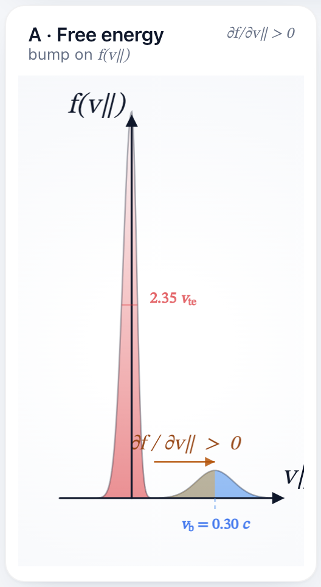
  <figcaption>Panel A: free energy</figcaption>
</figure>
```

The panel shows a reduced one-dimensional distribution $f(v_\parallel)$ because plasma emission is fundamentally a beam-aligned instability. A minimal model is

$$
f(v_\parallel) = f_M(v_\parallel) + f_b(v_\parallel),
$$

where $f_M$ is the background Maxwellian and $f_b$ is the beam contribution. If the beam is narrow and centered at $v_b > 0$, then on the low-velocity side of the beam peak the beam contribution rises with $v_\parallel$, so the total distribution can satisfy

$$
\frac{\partial f}{\partial v_\parallel} > 0.
$$

That positive slope is the source of free energy. Physically, a wave whose phase speed is near the beam speed sees more particles slightly faster than the wave than slightly slower than the wave, so the particles lose energy to the wave rather than Landau damping it.

### Panel B: Field-Aligned Beam Geometry

```{=latex}
\explorerthumb{figures/explorer-screenshots/plasma-panel-b-beam-geometry.png}{Panel B: beam geometry}
```

```{=html}
<figure class="explorer-thumb">
  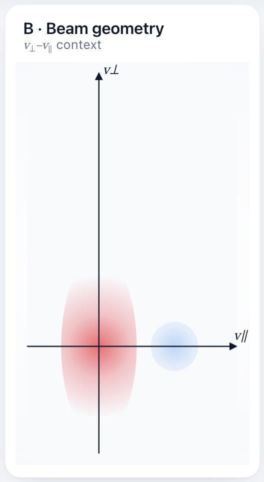
  <figcaption>Panel B: beam geometry</figcaption>
</figure>
```

The small inset in $v_\perp$-$v_\parallel$ space is only there to remind students that the beam is field aligned. It is not the primary physics plane for plasma emission. The reason is that the beam-driven plasma-emission instability is controlled mainly by the resonance along the magnetic field,

$$
\omega - k_\parallel v_\parallel \approx 0,
$$

for Langmuir-like waves with phase speed close to the beam speed. In this situation, the key comparison is not between different pitch angles, but between electrons that are slightly slower or slightly faster than the resonant phase speed along the field. That is why the sign of the slope in the parallel distribution matters so much.

If the background is approximately gyrotropic and the beam is confined to a small pitch-angle cone, one can compress the full distribution into a reduced one-dimensional function,

$$
F(v_\parallel) = 2\pi \int_0^\infty f(v_\parallel, v_\perp)\, v_\perp\, dv_\perp.
$$

The instability criterion is then read from the shape of $F(v_\parallel)$ near the resonant phase speed: if

$$
\frac{\partial F}{\partial v_\parallel} > 0
$$

at the resonance, the wave can grow; if the slope is negative, ordinary Landau damping wins. In other words, for plasma emission the essential free energy is a bump-on-tail structure in the \emph{parallel} distribution.

This is very different from ECM, where the decisive free energy is often a perpendicular or pitch-angle anisotropy and the full $v_\perp$-$v_\parallel$ geometry is the main physics space. For plasma emission, the 2D inset is therefore secondary. It gives geometric context by showing that the beam is narrow in pitch angle and sits on the $+v_\parallel$ side, but once that fact is established, the most informative plot is the reduced parallel distribution $F(v_\parallel)$.

### Panel C: Wave-Particle Energy Exchange

```{=latex}
\explorerthumb{figures/explorer-screenshots/plasma-panel-c-wave-particle.png}{Panel C: wave-particle exchange}
```

```{=html}
<figure class="explorer-thumb">
  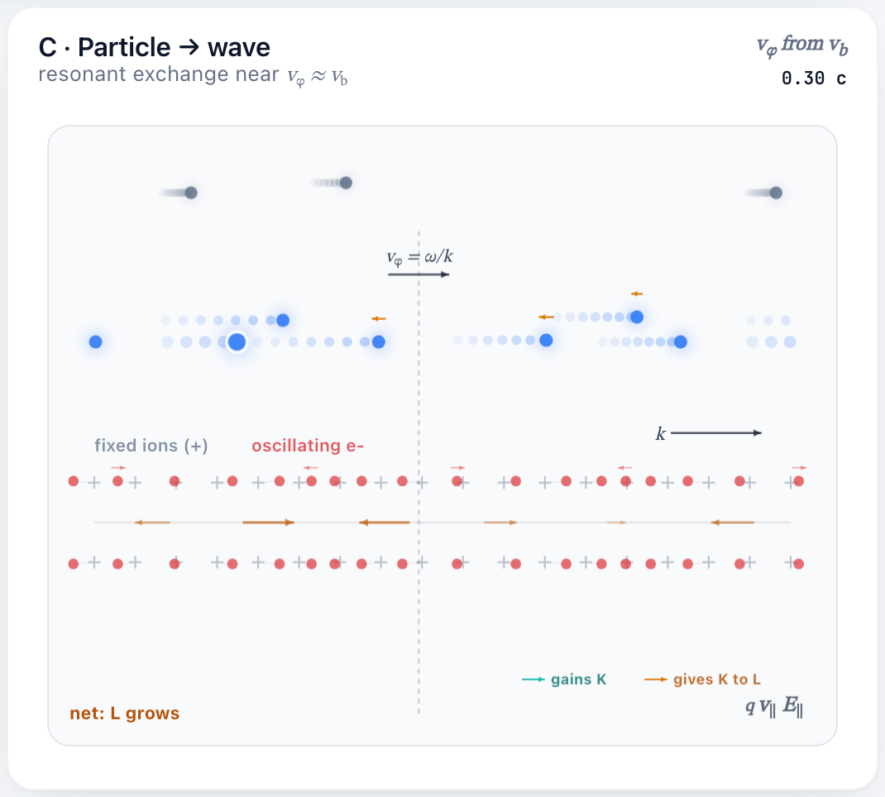
  <figcaption>Panel C: wave-particle exchange</figcaption>
</figure>
```

Panel C is meant to answer a common student question: *how does a bump in a velocity distribution become a wave?* The answer is resonant wave-particle interaction. For an electrostatic Langmuir wave with electric field approximately parallel to the beam,

$$
E_\parallel(x,t) = E_0 \cos(kx-\omega t),
$$

the important particles are those that remain nearly in phase with the wave. In the frame moving with the wave phase speed,

$$
v_\phi = \frac{\omega}{k},
$$

those particles see a slowly varying electric field rather than a rapidly oscillating one. The resonance condition is therefore

$$
\omega - k v_\parallel \approx 0
\quad \Longleftrightarrow \quad
v_\parallel \approx v_\phi .
$$

Particles slightly slower than the wave tend to be accelerated by the wave and take energy from it. Particles slightly faster than the wave tend to be decelerated by the wave and give energy to it. A Maxwellian tail has fewer fast particles than slow particles near a positive phase speed, so the wave loses energy: this is ordinary Landau damping. A bump-on-tail reverses that local imbalance. When

$$
\left. \frac{\partial F}{\partial v_\parallel} \right|_{v_\phi} > 0,
$$

there are more particles just faster than the wave than just slower than the wave. The net energy flow is then from beam particles into the wave. In the usual Landau-growth sign convention for Langmuir waves one can summarize the result as

$$
\gamma_L \propto
\left. \frac{\partial F}{\partial v_\parallel} \right|_{v_\phi},
$$

where $\gamma_L>0$ means wave growth and $\gamma_L<0$ means damping. This proportionality is not intended as a complete growth-rate formula in the explorer; it is the sign argument that the illustration is trying to make visible.

A useful classroom analogy is a surfer on an ocean wave. A surfer moving slightly slower than the wave is picked up and accelerated by it, so the wave does work on the surfer. A surfer moving slightly faster than the wave can push on the wave while being slowed down, so the surfer gives energy to the wave. A thermal distribution has more of the first kind than the second kind, so waves damp. A beam bump supplies an excess of the second kind, so the Langmuir wave grows.

The updated Panel C separates the wave from the resonant particles.  The fixed pale ion markers are
the almost stationary ion background.  The red electron markers oscillate horizontally about those
ions, showing the Langmuir wave as a **longitudinal** electron-density oscillation with
$\mathbf{E}_\parallel \parallel \mathbf{k}$.  The brown arrows along the ion row are the local
Langmuir electric field; their changing length represents the changing field strength
$|E_\parallel|$, not a particle path.

The blue and gray dots are the resonant particles near $v_\phi$.  Their faint trail dots mark
equal-time positions, so the trail spacing is a speed cue: wider spacing means faster motion and
compressed spacing means slower motion.  Blue particles start slightly faster than the wave and slow
down as they give kinetic energy to the Langmuir field.  Gray particles start slightly slower than
the wave and speed up as they take energy from the wave.  The local work rate is

$$
\frac{dK}{dt}
= q_e v_\parallel E_\parallel,
\qquad q_e=-e.
$$

The small arrows attached to the moving particles show this work sign.  Teal means
$q_e v_\parallel E_\parallel>0$, so the particle gains kinetic energy from the wave.  Amber means
$q_e v_\parallel E_\parallel<0$, so the particle gives kinetic energy to the Langmuir wave.  The
cartoon deliberately shows more blue fast-side particles than gray slow-side particles, so the net
exchange is

$$
\text{beam kinetic energy}
\longrightarrow
\text{electrostatic Langmuir-wave energy}.
$$

Only after this particle-to-wave step do the nonlinear wave-wave processes in the conversion map
become relevant.

### Panel D: Resonance on the Langmuir Branch

```{=latex}
\explorerthumb{figures/explorer-screenshots/plasma-panel-d-resonance.png}{Panel D: Langmuir resonance}
```

```{=html}
<figure class="explorer-thumb">
  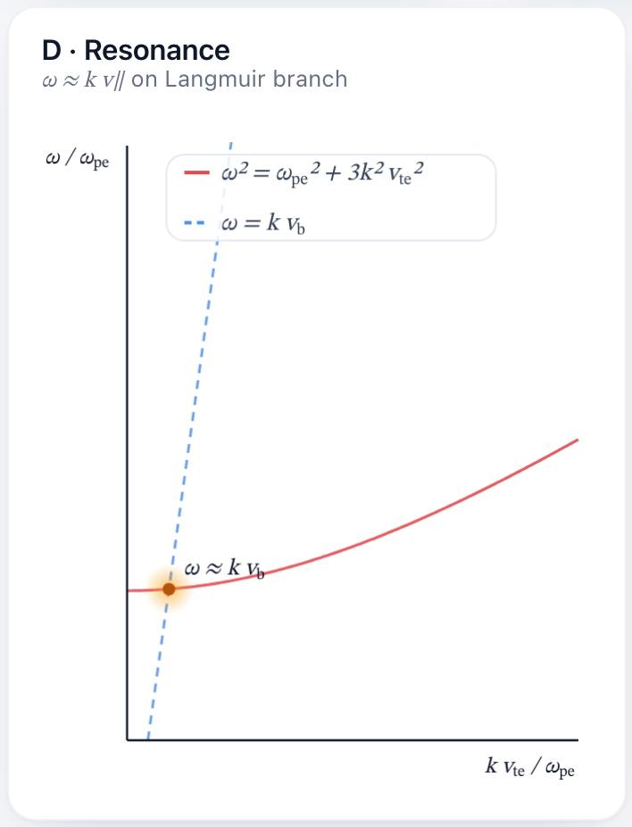
  <figcaption>Panel D: Langmuir resonance</figcaption>
</figure>
```

This panel is a resonance sketch in normalized $\omega$-$k$ space. The vertical axis is $\omega / \omega_{pe}$ and the horizontal axis is $k v_{te} / \omega_{pe}$. Its job is only to identify which Langmuir wave grows from the beam. The nonlinear conversion of that Langmuir energy into escaping radio emission is handled by the separate conversion-map pages.

#### Step 1: Beam Resonance Line

If a wave has phase speed

$$
v_\phi = \frac{\omega}{k},
$$

then resonance with the beam occurs when $v_\phi \approx v_b$, or equivalently

$$
\omega = k v_b.
$$

This is the dashed blue line. In the normalized coordinates

$$
x \equiv \frac{k v_{te}}{\omega_{pe}},
\qquad
y \equiv \frac{\omega}{\omega_{pe}},
$$

the resonance line is simply

$$
y = \frac{v_b}{v_{te}}\, x.
$$

That is why the blue line rotates when $v_b$ changes. In this normalization its slope is the dimensionless ratio $v_b / v_{te}$.

The graphical meaning of the line is simple: every point on it has phase speed equal to the beam
speed,

$$
\frac{\omega}{k}=v_b.
$$

But not every point on that line is an allowed plasma wave.  A real Langmuir wave must also lie on
the Langmuir dispersion relation.  Therefore the resonant mode is selected by satisfying both
conditions at once:

$$
\omega = k v_b,
\qquad
\omega^2 = \omega_{pe}^2 + 3k^2v_{te}^2.
$$

In the plot, "satisfying both conditions" is exactly the intersection between the dashed blue beam
line and the red Langmuir branch.  At that point, the wave is a legitimate Langmuir eigenmode and its
phase speed matches the beam, so beam electrons remain in nearly the same phase of the wave long
enough to exchange energy coherently.  Away from the intersection, either the wave is not on the
Langmuir branch, or its phase speed does not match the beam, so the interaction phase-mixes instead
of producing strong resonant growth.

#### Step 2: Langmuir Dispersion Relation

The red branch is the warm-plasma Langmuir dispersion relation,

$$
\omega^2 = \omega_{pe}^2 + 3 k^2 v_{te}^2.
$$

This expression can be derived from the linearized electron fluid equations plus Poisson's equation. Take small perturbations proportional to $\exp(i k x - i \omega t)$:

$$
\frac{\partial n_1}{\partial t} + n_0 \frac{\partial u_1}{\partial x} = 0,
$$

$$
\frac{\partial u_1}{\partial t}
= -\frac{e}{m_e} E_1 - \frac{1}{m_e n_0}\frac{\partial p_1}{\partial x},
$$

$$
\frac{\partial E_1}{\partial x} = -4 \pi e n_1.
$$

For an adiabatic one-dimensional electron pressure response, write

$$
p_1 \approx 3 n_1 k_B T_e = 3 m_e v_{te}^2 n_1.
$$

After Fourier substitution, the continuity equation gives

$$
-i \omega n_1 + i k n_0 u_1 = 0
\quad \Longrightarrow \quad
u_1 = \frac{\omega}{k n_0} n_1.
$$

The momentum equation becomes

$$
-i \omega u_1
=
-\frac{e}{m_e} E_1
- i k \, 3 v_{te}^2 \frac{n_1}{n_0}.
$$

From Poisson's equation,

$$
i k E_1 = -4 \pi e n_1
\quad \Longrightarrow \quad
E_1 = \frac{4 \pi i e}{k} n_1.
$$

Substituting both expressions into the momentum equation and eliminating $u_1$ gives

$$
\omega^2 = \frac{4 \pi n_0 e^2}{m_e} + 3 k^2 v_{te}^2.
$$

Recognizing

$$
\omega_{pe}^2 = \frac{4 \pi n_0 e^2}{m_e},
$$

we obtain

$$
\omega^2 = \omega_{pe}^2 + 3 k^2 v_{te}^2.
$$

Now divide by $\omega_{pe}^2$ and use $x = k v_{te} / \omega_{pe}$ to get the normalized red curve:

$$
y = \sqrt{1 + 3 \left(\frac{v_{te}}{v_b}\right)^2 x^2 }.
$$

The reason it looks almost flat in the panel is therefore explicit: in the corona $v_{te} \ll v_b$, so the correction term proportional to $(v_{te}/v_b)^2$ is small.

#### Step 3: Resonance Point

The orange dot is the intersection of the blue and red curves. Set the two expressions equal:

$$
\frac{v_b}{v_{te}} x = \sqrt{1 + 3 x^2 }.
$$

Squaring both sides,

$$
\left(\frac{v_b}{v_{te}}\right)^2 x^2 = 1 + 3 x^2,
$$

so

$$
x^2 \left[\left(\frac{v_b}{v_{te}}\right)^2 - 3 \right] = 1.
$$

Thus,

$$
x_{\mathrm{res}}
=
\left[\left(\frac{v_b}{v_{te}}\right)^2 - 3 \right]^{-1/2},
$$

and therefore

$$
y_{\mathrm{res}}
=
\frac{v_b}{v_{te}} x_{\mathrm{res}}
=
\left[1 - 3 \left(\frac{v_{te}}{v_b}\right)^2 \right]^{-1/2}.
$$

This expression shows immediately that the resonance point is not exactly at $\omega/\omega_{pe} = 1$ unless one takes the cold-plasma limit $v_{te}/v_b \rightarrow 0$. For any finite warm-plasma correction,

$$
y_{\mathrm{res}} > 1.
$$

Thus the orange resonance point lies slightly above $\omega=\omega_{pe}$. In the default solar-coronal parameters used in the explorer, $v_{te} \ll v_b$, so the excess above unity is small and the dot visually appears almost at $\omega/\omega_{pe}=1$.

This only makes sense if

$$
1 - 3 \left(\frac{v_{te}}{v_b}\right)^2 > 0,
$$

or

$$
v_b > \sqrt{3}\, v_{te}.
$$

That is the basic speed threshold implied by the warm-fluid resonance sketch. It is not a full nonlinear instability criterion, but it explains why a sufficiently fast beam is needed.

## Plasma Radiation Conversion Map and Companion Pages

The plasma-emission explorer stops at the point where beam energy has produced electrostatic
Langmuir turbulence.  The companion conversion pages start from that point.  Their purpose is to
show how electrostatic Langmuir energy can become transverse electromagnetic radiation.

**Assumptions and scope.** The conversion pages use schematic $\omega$-$k$ matching for Langmuir, ion-sound, and transverse electromagnetic branches. They teach conservation of frequency and wavevector in common fundamental and harmonic channels. They do not compute conversion efficiency, angular emissivity, saturation, scattering by inhomogeneity, or full kinetic mode coupling.

### Why the Conversion Map Is Needed

The red curve and orange dot only describe Langmuir-wave growth. Langmuir waves are electrostatic. To get escaping radio emission, a second step is needed. In symbolic form:

$$
L \rightarrow T(\omega_{pe}),
$$

or

$$
L + L' \rightarrow T(2\omega_{pe}),
$$

where $L$ denotes Langmuir waves and $T$ denotes an escaping transverse electromagnetic wave. The panel title therefore combines two linked but distinct pieces of physics:

1. resonant beam-driven growth of $L$,
2. nonlinear conversion of $L$ into escaping radio emission.

For slide use, the wave-conversion chain is shown below as a standalone process diagram:


\clearpage

```{=latex}
\begin{center}
{\Large\bfseries Plasma Radiation Conversion Diagram}

\vspace{6mm}

\begin{tikzpicture}[x=1cm,y=1cm]
\tikzset{
  flowbox/.style={
    draw=black,
    rounded corners=2pt,
    line width=0.7pt,
    fill=white,
    align=center,
    inner sep=6pt,
    font=\small
  },
  flowarrow/.style={
    ->,
    line width=0.8pt
  }
}

\node[flowbox, minimum width=4.2cm] (beam) at (0,10.6)
  {\textbf{Electron beam}\\$v_b \gg v_{te}$};

\node[flowbox, minimum width=4.8cm] (instability) at (0,8.4)
  {\textbf{Beam instability}\\bump-on-tail growth};

\node[flowbox, minimum width=5.3cm] (langmuir) at (0,6.15)
  {\textbf{Primary Langmuir waves}\\$L(\omega \approx \omega_{pe})$};

\node[flowbox, minimum width=5.0cm] (fundbranch) at (-4.3,3.7)
  {\textbf{Scattering / mode conversion}\\$L + S \rightarrow T(\omega \approx \omega_{pe})$};

\node[flowbox, minimum width=4.8cm] (fundamental) at (-4.3,1.25)
  {\textbf{Fundamental emission}\\$\omega \approx \omega_{pe}$};

\node[flowbox, minimum width=4.7cm] (backscatter) at (4.3,3.7)
  {\textbf{Backscattering / decay}\\$L \rightarrow L' + S$};

\node[flowbox, minimum width=4.8cm] (backlangmuir) at (4.3,1.25)
  {\textbf{Backscattered Langmuir waves}\\$L'$};

\node[flowbox, minimum width=5.9cm] (coalescence) at (0,-1.25)
  {\textbf{Langmuir-wave coalescence}\\primary $L$ + backscattered $L'$\\$\rightarrow T(\omega \approx 2\omega_{pe})$};

\node[flowbox, minimum width=4.4cm] (harmonic) at (0,-3.75)
  {\textbf{Harmonic emission}\\$\omega \approx 2\omega_{pe}$};

\draw[flowarrow] (beam) -- (instability);
\draw[flowarrow] (instability) -- (langmuir);

\draw[flowarrow] (langmuir) -- (fundbranch);
\draw[flowarrow] (fundbranch) -- (fundamental);

\draw[flowarrow] (langmuir) -- (backscatter);
\draw[flowarrow] (backscatter) -- (backlangmuir);
\draw[flowarrow] (langmuir.south) -- ++(0,-0.8) -| (coalescence.north);
\draw[flowarrow] (backlangmuir.south) -- ++(0,-0.8) -| (coalescence.east);
\draw[flowarrow] (coalescence) -- (harmonic);
\end{tikzpicture}
\end{center}
```

How to read the blocks:

- **Electron beam.** This is the nonthermal fast-electron population injected by a flare, reconnection site, or shock environment. It supplies the free energy.
- **Beam instability.** Once the reduced distribution develops a bump on the tail, the resonance $\omega \approx k_\parallel v_b$ allows the beam to pump electrostatic waves instead of damping them.
- **Primary Langmuir waves.** These are the first strong plasma oscillations generated by the beam. They live near the local plasma frequency and are still electrostatic, so they do not yet escape as radio emission.
- **Scattering / mode conversion.** Interaction of Langmuir waves with ion-sound waves or low-frequency density fluctuations can convert part of the Langmuir spectrum into an escaping electromagnetic mode near the local plasma frequency. This is the pedagogical fundamental-emission channel.
- **Backscattering / decay.** A forward Langmuir wave can decay or scatter into a backward Langmuir wave plus a low-frequency wave. That step builds the counter-propagating Langmuir population needed for efficient harmonic production.
- **Backscattered Langmuir waves.** These are the $L'$ waves in the diagram. They are not the observed radio wave; they are the partner population that can coalesce with the original Langmuir waves.
- **Langmuir-wave coalescence.** A forward and backward Langmuir pair can merge nonlinearly, producing a transverse electromagnetic wave near $2\omega_{pe}$.
- **Fundamental emission.** Escaping radiation near the plasma frequency. In real plasmas several closely related scattering channels can contribute; the diagram shows the standard pedagogical one.
- **Harmonic emission.** Escaping radiation near twice the plasma frequency, usually associated with $L + L' \rightarrow T(2\omega_{pe})$.

Here $S$ stands for an ion-sound wave or low-frequency density fluctuation, and $T$ stands for the escaping transverse electromagnetic mode. Read the chart from top to bottom: first the beam pumps Langmuir waves, and then nonlinear wave-wave coupling converts part of that electrostatic energy into radio emission that can escape.

### What the Nonlinear Blocks Mean

The four nonlinear blocks in the diagram are where the electrostatic Langmuir turbulence is turned into something an observer can actually detect. These steps are often drawn as a compact symbolic chain, but each block encodes a specific frequency-matching and wavevector-matching idea.

#### Scattering / Mode Conversion

The fundamental branch is often written schematically as

$$
L + S \rightarrow T,
$$

with matching conditions

$$
\omega_L + \omega_S = \omega_T,
\qquad
\mathbf{k}_L + \mathbf{k}_S = \mathbf{k}_T.
$$

Here $L$ is a Langmuir wave, $S$ is an ion-sound wave or low-frequency density perturbation, and $T$ is the escaping transverse electromagnetic mode. Because the low-frequency partner satisfies $\omega_S \ll \omega_{pe}$, the emitted electromagnetic wave lands near the fundamental:

$$
\omega_T \approx \omega_L \approx \omega_{pe}.
$$

The physical order is important.  The red point comes first: the electron beam excites a primary
Langmuir wave.  The blue transverse wave is the later conversion product.  Therefore the red point in
Panel A is not an arbitrary point on the Langmuir branch; it is selected by the beam-particle
resonance,

$$
\omega_L \approx k_L v_b,
$$

and since $\omega_L \approx \omega_{pe}$,

$$
k_L \approx \frac{\omega_{pe}}{v_b}.
$$

For a nonrelativistic or mildly relativistic electron beam, $v_b \ll c$.  Therefore

$$
k_L \approx \frac{\omega_{pe}}{v_b}
\gg
\frac{\omega_{pe}}{c}.
$$

This is the source side of the mismatch: the beam naturally produces an electrostatic Langmuir wave
with a relatively large wavenumber.

The main physical role of the $S$ wave is to help satisfy the momentum mismatch. A pure Langmuir wave is electrostatic and does not simply continue into a freely propagating radio wave. The additional low-frequency fluctuation scatters the Langmuir wave in frequency-wavevector space so that an electromagnetic branch can be accessed. That is why many lecture notes refer to this step as either *scattering* or *mode conversion*: the energy remains near the same characteristic frequency, but the wave changes from electrostatic to transverse electromagnetic.

The phrase "does not propagate" needs one important qualification. A Langmuir wave is not literally motionless; in a warm plasma it has a finite group velocity. What it does **not** do efficiently is propagate as an escaping transverse radio wave. There are two separate reasons.

First, the Langmuir mode is primarily longitudinal and electrostatic. Its electric field is approximately parallel to the wavevector,

$$
\mathbf{E}_L \parallel \mathbf{k}_L,
$$

and the mode is obtained mainly from charge separation and Poisson's equation, not from a self-sustaining transverse electromagnetic field. In an ideal electrostatic Langmuir oscillation the perturbed magnetic field is negligible:

$$
\mathbf{B}_L \simeq 0.
$$

Therefore the wave does not carry energy away like a radio wave with transverse $\mathbf{E}$, transverse $\mathbf{B}$, and an outward Poynting flux $\mathbf{S}_{\mathrm{Poynting}} \propto \mathbf{E}\times\mathbf{B}$. It is better to think of the red branch in the figure as plasma sloshing: electrons oscillate against the ion background, storing strong electrostatic energy, but the oscillation is poorly coupled to free-space radiation.

Second, the red Langmuir branch is almost flat near $\omega_{pe}$. From

$$
\omega_L^2 \approx \omega_{pe}^2 + 3 k_L^2 v_{te}^2,
$$

the group velocity of Langmuir-wave energy is

$$
v_{g,L}
= \frac{\partial \omega_L}{\partial k_L}
= \frac{3 k_L v_{te}^2}{\omega_L}.
$$

For the beam-driven waves in the plasma-emission explorer, the resonance condition gives

$$
v_\phi = \frac{\omega_L}{k_L} \approx v_b,
$$

so the beam selects a resonant wavenumber

$$
k_{\mathrm{res}} \approx \frac{\omega_L}{v_b}
\approx \frac{\omega_{pe}}{v_b}.
$$

There is a continuum of possible Langmuir modes on the red dispersion branch, each with its own
$k_L$ and therefore its own group velocity.  The beam does not excite all of them equally.  It
couples most strongly to the part of the branch whose phase speed matches the beam.  Evaluating the
Langmuir group velocity at that selected wavenumber gives

$$
v_{g,L}
\approx
\left.
\frac{3 k_L v_{te}^2}{\omega_L}
\right|_{k_L=k_{\mathrm{res}}}
\approx
\frac{3v_{te}^2}{v_b}.
$$

The dependence is therefore inverse in $v_b$, not inverse in $v_b^2$.  A faster beam resonates with a
smaller Langmuir wavenumber and therefore with a smaller Langmuir group velocity.  A slower beam
would select a larger $k_L$ and a larger $v_{g,L}$, although if the beam approaches the thermal
speed the simple warm-fluid picture becomes less useful because ordinary Landau damping is strong.
Since the beam speed is usually much larger than the thermal speed, $v_b \gg v_{te}$, this group
velocity is small compared with both $v_b$ and $c$. Thus the Langmuir wave energy tends to remain
local to the source region or beam-plasma turbulence instead of streaming freely to the observer.

By contrast, the blue branch is the transverse electromagnetic branch. In the figure, the word "transverse" is not meant to be inferred from the curvature alone. It is a statement about the wave eigenvector. The transverse electromagnetic mode satisfies

$$
\mathbf{k}_T \cdot \mathbf{E}_T = 0,
\qquad
\mathbf{B}_T = \frac{\mathbf{k}_T \times \mathbf{E}_T}{\omega_T},
$$

so its electric and magnetic fields are both perpendicular to the propagation direction. That is the field geometry of an escaping radio wave.

One quick derivation starts from the cold electron response in an unmagnetized plasma. For a plane wave proportional to $\exp(i\mathbf{k}\cdot\mathbf{x}-i\omega t)$, the linearized electron momentum equation gives

$$
-i\omega m_e \mathbf{v}_1 = -e\mathbf{E}_1,
$$

so the induced current is

$$
\mathbf{J}_1
= -n_0 e\mathbf{v}_1
= i\frac{n_0e^2}{m_e\omega}\mathbf{E}_1.
$$

Inserting this current into Maxwell's equations gives the plasma dielectric response

$$
\epsilon(\omega) = 1 - \frac{\omega_{pe}^2}{\omega^2}.
$$

The electromagnetic wave equation can be written schematically as

$$
\mathbf{k}\times(\mathbf{k}\times\mathbf{E})
+ \frac{\omega^2}{c^2}\epsilon(\omega)\mathbf{E}=0.
$$

For the transverse branch, $\mathbf{k}\cdot\mathbf{E}=0$, so

$$
\mathbf{k}\times(\mathbf{k}\times\mathbf{E})
= -k^2\mathbf{E}.
$$

The wave equation then reduces to

$$
k_T^2 c^2
= \omega_T^2\left(1-\frac{\omega_{pe}^2}{\omega_T^2}\right)
= \omega_T^2-\omega_{pe}^2,
$$

or

$$
\omega_T^2 \approx \omega_{pe}^2 + c^2 k_T^2,
$$

which is the blue curve in the panel. This is why the blue branch is called $T$: it is the transverse electromagnetic eigenmode of the plasma. The red Langmuir branch is different not merely because it is flatter, but because it has a longitudinal/electrostatic eigenvector, approximately $\mathbf{E}_L \parallel \mathbf{k}_L$ and $\mathbf{B}_L \simeq 0$.

The group velocity of the transverse branch is

$$
v_{g,T}
= \frac{\partial \omega_T}{\partial k_T}
= \frac{c^2 k_T}{\omega_T}
= c\sqrt{1-\frac{\omega_{pe}^2}{\omega_T^2}}.
$$

Just above the local cutoff, $v_{g,T}$ can still be modest, but the wave is already on the transverse electromagnetic branch. As it moves into regions of lower density, the local $\omega_{pe}$ decreases, the ratio $\omega_T/\omega_{pe}$ increases, and the mode escapes more like an ordinary radio wave. The red point in the panel marks the energetic electrostatic Langmuir wave; the blue point marks the transverse branch that can become observable radiation.

To make that picture less abstract, write the approximate dispersions for the three participating branches:

$$
\omega_L^2 \approx \omega_{pe}^2 + 3 k_L^2 v_{te}^2,
$$

$$
\omega_T^2 \approx \omega_{pe}^2 + c^2 k_T^2,
$$

and, for an ion-sound mediator,

$$
\omega_S \approx k_S c_s,
\qquad
c_s \approx \sqrt{\frac{k_B T_e}{m_i}}
\quad
(T_e \gg T_i \text{ limit}).
$$

Near the fundamental electromagnetic cutoff, the escaping transverse mode has a much smaller wavevector than the electrostatic Langmuir mode.  This is the step that is easiest to miss from the plot, so it is worth deriving it.

For the electromagnetic branch,

$$
\omega_T^2 \approx \omega_{pe}^2 + c^2 k_T^2,
$$

so

$$
k_T
= \frac{1}{c}\sqrt{\omega_T^2-\omega_{pe}^2}.
$$

At fundamental emission, $\omega_T$ is only slightly above the local cutoff $\omega_{pe}$.  Therefore the square root is small.  The EM wave is a real transverse mode, but just above cutoff its wavevector is still small.

This does **not** contradict the familiar vacuum formula $\lambda_0=2\pi c/\omega_T$.  That formula assumes the wave is already in vacuum, where $k_0=\omega_T/c$.  Inside a plasma the transverse electromagnetic mode has a refractive index

$$
n^2
= \frac{c^2k_T^2}{\omega_T^2}
= 1-\frac{\omega_{pe}^2}{\omega_T^2}.
$$

Thus

$$
k_T = \frac{n\omega_T}{c},
\qquad
\lambda_T = \frac{2\pi}{k_T}
= \frac{2\pi c}{n\omega_T}
= \frac{\lambda_0}{n}.
$$

Near cutoff, $\omega_T\approx\omega_{pe}$ and therefore $n\ll 1$.  The plasma wavelength $\lambda_T$ is then much longer than the vacuum wavelength $\lambda_0$.  The frequency is fixed, but the wavelength is not fixed by the vacuum relation because the wave is propagating in a dispersive medium.

Small $k_T$ also has a propagation meaning, but this point needs careful wording.  A small real $k_T$ is **not** the same thing as "no propagation."  The transverse branch has group velocity

$$
v_{g,T}
= \frac{\partial\omega_T}{\partial k_T}
= \frac{c^2k_T}{\omega_T}
= cn.
$$

There are three distinct cases:

1. If $\omega_T<\omega_{pe}$, then $k_T$ is imaginary.  This is evanescent; it does not freely propagate.
2. If $\omega_T=\omega_{pe}$, then $k_T=0$ and $v_{g,T}=0$.  This is the exact cutoff.
3. If $\omega_T>\omega_{pe}$, then $k_T$ is real.  Just above cutoff it is small, so the wave is allowed but has long wavelength and small group velocity.

Efficient escape happens after the wave moves into lower-density plasma, where the local $\omega_{pe}$ decreases, $n$ increases, and $v_{g,T}$ approaches $c$.

Mode conversion and propagation play different roles. The scattering step creates a transverse electromagnetic wave on the correct branch. At the source, that transverse wave may still have small $k_T$ and small group velocity. If its frequency is slightly above the local cutoff, it can begin to propagate; as it moves outward into lower density, the same fixed wave frequency sees a smaller local $\omega_{pe}$, so the dispersion relation gives a larger real $k_T$:

$$
k_T(r)
= \frac{1}{c}\sqrt{\omega_T^2-\omega_{pe}^2(r)}.
$$

Thus there are two separate steps.  Panel A of the HTML only shows the first one.

1. **Mode conversion:** $L+S\rightarrow T$ changes the wave from electrostatic to transverse electromagnetic and satisfies local frequency-wavevector matching.
2. **Propagation through the density gradient:** after conversion, decreasing $\omega_{pe}(r)$ lets the already-created $T$ wave acquire larger $k_T$ and larger group velocity.

The matching condition therefore moves the energy onto the electromagnetic branch, while the outward density gradient makes that already-created electromagnetic wave increasingly freely propagating.

Combining the source-side beam-resonance estimate for $k_L$ with the target-side near-cutoff estimate
for $k_T$ gives the important ordering

$$
k_T \ll k_L.
$$

Now apply the wavevector matching condition.  In a one-dimensional sketch, choose the primary Langmuir wave to travel in the positive direction, so $k_L>0$.  The matching condition is

$$
k_L + k_S = k_T,
$$

or

$$
k_S = k_T-k_L.
$$

Because the newly produced electromagnetic wave is near cutoff, $k_T$ is small compared with $k_L$.  Therefore

$$
k_S \approx -k_L.
$$

The negative sign is essential. In magnitude, $|k_S|\approx |k_L|$, but the direction is opposite. The low-frequency fluctuation supplies the wavevector needed to move the energy from the large-$k_L$ electrostatic branch onto the small-$k_T$ electromagnetic branch:

$$
\underbrace{k_L}_{\text{large, positive}}
+
\underbrace{k_S}_{\text{large, negative}}
=
\underbrace{k_T}_{\text{small, positive}}.
$$

Most of the Langmuir wavevector is cancelled by the scattering fluctuation. The result is a small-$k_T$ transverse wave near cutoff. Escape then depends on $\omega_T$ being above the local cutoff and on the density gradient outside the source. As the same wave moves outward into lower-density plasma, the decreasing local $\omega_{pe}$ makes the allowed transverse wavenumber grow.

The same fixed emitted frequency $\omega_T$ therefore has two different transverse wavenumbers at two different places:

$$
k_{T,\mathrm{source}}
= \frac{1}{c}\sqrt{\omega_T^2-\omega_{pe}^2(\mathrm{source})}
\quad \text{small, near cutoff},
$$

but farther outward,

$$
k_{T,\mathrm{out}}
= \frac{1}{c}\sqrt{\omega_T^2-\omega_{pe}^2(\mathrm{out})}
>
k_{T,\mathrm{source}},
$$

because $\omega_{pe}(\mathrm{out})<\omega_{pe}(\mathrm{source})$.  That outward increase is a propagation/refraction effect, not the role of $S$.

The initial fluctuation $S$ is part of the plasma environment: an ion-sound wave, density ripple, or turbulence component with some wavevector.  When a Langmuir wave scatters from that fluctuation, the fluctuation supplies or absorbs the missing spatial momentum, much like a diffraction grating supplies reciprocal-lattice momentum in optics.

The negative sign is therefore a direction statement: the scattering fluctuation must provide a wavevector mostly opposite to the original Langmuir wave.  It does **not** mean that the $S$ wave supplies a comparable amount of energy.  For an ion-sound wave,

$$
\omega_S \approx |k_S|c_s
\approx k_L c_s
\approx \omega_{pe}\frac{c_s}{v_b}.
$$

Since $c_s \ll v_b$, the frequency carried by $S$ is still small even though its wavevector can be large:

$$
\omega_S \ll \omega_{pe}.
$$

This is the key point: $S$ is mainly a **wavevector broker**, not an energy source.  It changes the spatial scale and direction of the disturbance enough that the energy of an electrostatic Langmuir wave can land on the transverse electromagnetic branch.

The physical picture is that a Langmuir wave packet encounters an ion-sound wave or a low-frequency density clump and is scattered in $(\omega,\mathbf{k})$ space onto the transverse electromagnetic branch. The frequency changes only slightly because $\omega_S \ll \omega_{pe}$, but the wavevector changes substantially because the Langmuir wave and escaping EM wave occupy very different dispersion surfaces.

An intuitive analogy is a violin string pressed against the wooden bridge. The string itself stores oscillatory energy, but the air does not hear much until the bridge provides the mechanical coupling that lets the motion shake the body of the violin and launch sound. Here the Langmuir wave is like the string motion: intense, local, and poorly coupled to radiation. The ion-sound fluctuation or density ripple plays the role of the bridge. It does not supply much frequency; instead it supplies the missing spatial coupling that lets electrostatic motion shake the electromagnetic field.

This channel is efficient only if the plasma provides a usable low-frequency scattering agent. There must be either ion-sound turbulence or sufficiently strong density inhomogeneity, the fluctuation level must be large enough to cause significant scattering, and damping of the low-frequency mode must not be too strong. In the ion-sound version of the mechanism, one usually wants

$$
T_e \gtrsim T_i,
$$

and often more strongly $T_e \gg T_i$, so that ion-sound waves are not immediately suppressed by ion Landau damping.

#### Visual Script for `plasma-fundamental-conversion.html`

```{=latex}
\begin{center}
\gallerythumb{figures/explorer-screenshots/plasma-conversion-branch-matching.png}{Branch matching}\hfill
\gallerythumb{figures/explorer-screenshots/plasma-conversion-mode-conversion.png}{Mode conversion}\hfill
\gallerythumb{figures/explorer-screenshots/plasma-conversion-fundamental-escape.png}{Fundamental escape}
\end{center}
```

```{=html}
<div class="explorer-gallery">
  <figure>
    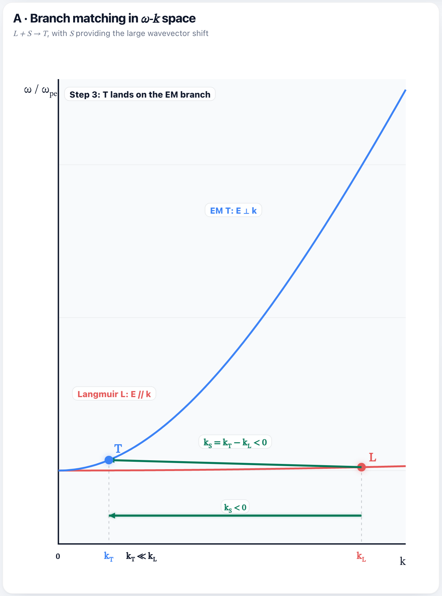
    <figcaption>Branch matching</figcaption>
  </figure>
  <figure>
    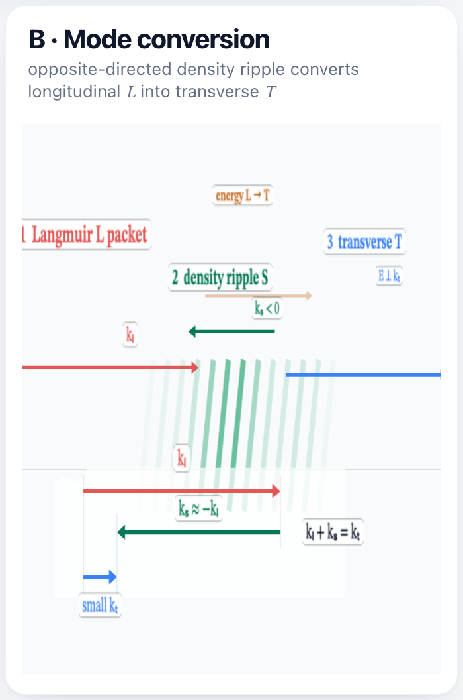
    <figcaption>Mode conversion</figcaption>
  </figure>
  <figure>
    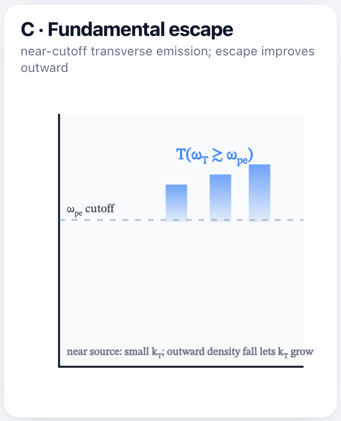
    <figcaption>Fundamental escape</figcaption>
  </figure>
</div>
```

Use the dedicated fundamental-conversion page as a three-step frequency-wavevector diagram. The red point is the primary Langmuir wave $L$: it lives close to $\omega_{pe}$ but is electrostatic, so by itself it is not yet escaping radio emission. The blue transverse branch is the electromagnetic mode $T$ that can propagate away, with a wavevector set by the transverse dispersion relation rather than by the original beam resonance.

The green dashed arrow represents the low-frequency partner $S$. Its main job is not to add much energy:

$$
\Delta \omega = \omega_S \ll \omega_{pe}.
$$

Its main job is to supply the missing spatial momentum:

$$
\Delta \mathbf{k} = \mathbf{k}_S
  = \mathbf{k}_T - \mathbf{k}_L.
$$

That is why the page emphasizes "small $\Delta\omega$, large $|\Delta k|$." In words: the density ripple acts like a moving diffraction grating. It scatters the electrostatic Langmuir oscillation into a transverse electromagnetic oscillation while keeping the frequency close to the local plasma frequency.

The real-space cartoon on the page is only an analogy for the coupling. A longitudinal electrostatic packet encounters a density ripple or ion-sound compression; after the interaction, part of the energy appears as a transverse packet. The final card marks the observational consequence: the escaped radiation is fundamental plasma emission,

$$
\omega_T \gtrsim \omega_{pe},
$$

so its escape is sensitive to the local cutoff and to propagation through overlying plasma.

#### Backscattering / Decay

The backscattering block is commonly written as

$$
L \rightarrow L' + S,
$$

with matching conditions

$$
\omega_L = \omega_{L'} + \omega_S,
\qquad
\mathbf{k}_L = \mathbf{k}_{L'} + \mathbf{k}_S.
$$

Again $\omega_S$ is small compared with $\omega_{pe}$, so the parent and daughter Langmuir waves both remain close to the plasma frequency. The important change is in the propagation direction: the daughter Langmuir wave $L'$ is typically driven toward the opposite sign of $k_\parallel$, so it is natural to call it a *backscattered* Langmuir wave. In words, the beam first pumps a forward Langmuir spectrum, and then nonlinear decay builds the counter-propagating partner population that the harmonic channel needs.

This step matters because a single one-way Langmuir spectrum is not enough to make the harmonic branch efficient. Harmonic emission needs two Langmuir populations with nearly opposite wavevectors so that their wavevector sum is small enough to match a freely propagating electromagnetic wave.

The physical picture is parametric decay. Once the forward Langmuir turbulence becomes strong enough, the electrostatic wave can nonlinearly couple to the density field and split into two daughter disturbances: a second Langmuir wave and a low-frequency compressive mode. The sound-like daughter carries away only a small fraction of the energy but a large fraction of the wavevector.

The everyday analogy is a fast skater pushing off a loose sled on ice. The skater may keep nearly the same kind of motion after the push, but the sled can carry away a large amount of momentum because momentum, unlike energy here, can be rearranged very effectively between the two objects. The ion-sound wave is the sled: it is slow and low frequency, but it can take the recoil needed to turn a forward Langmuir oscillation into a backward one.

Because the ion-sound speed is much smaller than the Langmuir-wave phase speed,

$$
c_s \ll \frac{\omega_L}{k_L},
$$

the resonance conditions prefer a daughter Langmuir wave with nearly the same $|k|$ as the parent but with the opposite sign. In the simplest backscatter limit this becomes

$$
k_{L'} \approx -k_L,
\qquad
k_S \approx 2k_L.
$$

One can understand that result qualitatively from the matching rules alone. Since $\omega_S$ is small, the parent and daughter Langmuir frequencies must be nearly equal:

$$
\omega_L(k_L) \approx \omega_{L'}(k_{L'}).
$$

For the Langmuir branch that usually implies similar magnitudes of wavenumber, and then the momentum condition is easiest to satisfy by reversing the Langmuir direction and letting the low-frequency mode absorb the difference.

This decay channel needs more than just the existence of a beam. The beam must first build up enough Langmuir intensity that nonlinear coupling outruns linear damping, and the low-frequency daughter mode must survive long enough to participate. Strong damping of ion-sound waves can weaken or suppress the backscattering route.

#### Backscattered Langmuir Waves

The $L'$ box is therefore not a radio-emission box. It is an intermediate reservoir of electrostatic turbulence. Its importance is geometric: once both $L$ and $L'$ exist, one has the pair of nearly counter-propagating plasma waves needed for coalescence. In many treatments one summarizes this by saying that the decay step populates the backward half of Langmuir-wave phase space.

There is also a direct kinematic reason $L'$ matters. The harmonic electromagnetic wave must still satisfy the transverse dispersion relation

$$
\omega_T^2 = \omega_{pe}^2 + c^2 k_T^2.
$$

If it is emitted near the second harmonic, $\omega_T \approx 2\omega_{pe}$, then its allowed wavevector is only

$$
k_T \approx \frac{\sqrt{3}\,\omega_{pe}}{c}.
$$

By contrast, a beam-driven Langmuir wave typically sits near

$$
k_L \sim \frac{\omega_{pe}}{v_b},
$$

so for $v_b \ll c$ one has

$$
k_L \gg \frac{\omega_{pe}}{c}.
$$

That means two forward Langmuir waves would have a total wavevector of order $2k_L$, which is far too large to match the electromagnetic branch near $2\omega_{pe}$. The backward Langmuir population $L'$ is therefore not optional bookkeeping. It is the piece that makes wavevector cancellation possible.

In physical language, $L'$ stores electrostatic energy in the backward half of phase space until a forward-backward pair exists. Only then can the harmonic branch satisfy both frequency addition and near-cancellation of the large Langmuir wavenumbers.

One way to picture $L'$ is as the return stroke in a two-person saw. If everyone pulls in the same direction, the whole saw moves but does not do the intended alternating work. The backward Langmuir population supplies the opposed motion. It is not the final sound heard by the observer; it is the necessary partner motion that lets the next step produce a wave with a much smaller net wavevector.

#### Langmuir-Wave Coalescence

The harmonic branch is written as

$$
L + L' \rightarrow T,
$$

with matching conditions

$$
\omega_L + \omega_{L'} = \omega_T,
\qquad
\mathbf{k}_L + \mathbf{k}_{L'} = \mathbf{k}_T.
$$

Because both Langmuir waves sit near $\omega_{pe}$,

$$
\omega_T \approx \omega_L + \omega_{L'} \approx 2\omega_{pe},
$$

so the emitted radiation appears near the harmonic. At the same time, if the two Langmuir waves are nearly oppositely directed, then

$$
\mathbf{k}_{L'} \approx -\mathbf{k}_L,
$$

which makes

$$
\mathbf{k}_T \approx \mathbf{0}
$$

or at least much smaller than the original Langmuir wavenumbers. That is exactly what the electromagnetic branch needs: an escaping transverse wave near $2\omega_{pe}$ with a relatively small net wavevector. This is the clean physical reason the harmonic channel is often drawn as the merger of a forward and backward Langmuir pair.

The physical picture is therefore a true merger of two electrostatic wave packets. One packet belongs to the original beam-driven forward Langmuir turbulence; the other belongs to the backward Langmuir turbulence created by decay or scattering. When those spectra overlap in both space and wavenumber, their nonlinear current can radiate onto the transverse electromagnetic branch.

The useful analogy is two people pushing a heavy door from opposite sides with timed, oscillatory pushes. If both pushes were from the same side, the door would be driven along with a large net shove. If the pushes are nearly opposite, the large back-and-forth motions partly cancel as translations, but their combined timing can still drive the door's flexing mode. In the plasma, the two Langmuir waves cancel most of their large wavevectors while adding their frequencies, leaving a transverse electromagnetic oscillation near twice the plasma frequency.

The harmonic condition can be written more precisely as

$$
\omega_T \approx 2\omega_{pe},
\qquad
\mathbf{k}_{L'} \approx -\mathbf{k}_L + \mathbf{k}_T,
$$

with

$$
k_T \approx \frac{\sqrt{3}\,\omega_{pe}}{c}.
$$

So the two Langmuir waves do not need to cancel *exactly*; they need to cancel up to the relatively small electromagnetic wavevector that the harmonic branch allows.

This process is favored when three conditions are met:

1. the forward Langmuir turbulence is strong,
2. a substantial backward Langmuir population has already been created,
3. the spectra are broad enough and overlap enough that the resonance conditions can be met over a finite region of $(\omega,\mathbf{k})$ space.

Harmonic emission is often observationally robust because once it is produced near $2\omega_{pe}$ it lies comfortably above the local plasma cutoff. In that sense the hard part of the harmonic channel is not usually the final escape; it is building the right counter-propagating Langmuir geometry in the first place.

In classroom language:

1. the **fundamental** channel uses a low-frequency fluctuation to scatter an electrostatic Langmuir wave onto an electromagnetic branch near $\omega_{pe}$;
2. the **harmonic** channel first creates a backward Langmuir partner and then merges the forward and backward Langmuir waves into an escaping mode near $2\omega_{pe}$.

## Plasma Emission Explorer: Density Drift and Dynamic Spectrum

The final two panels return to the original plasma-emission explorer.  After Langmuir growth and
conversion have produced escaping radiation, the source height and density gradient determine what
frequency an observer records as a function of time.

### Panel E: Density Drift

```{=latex}
\explorerthumb{figures/explorer-screenshots/plasma-panel-e-density-drift.png}{Panel E: density drift}
```

```{=html}
<figure class="explorer-thumb">
  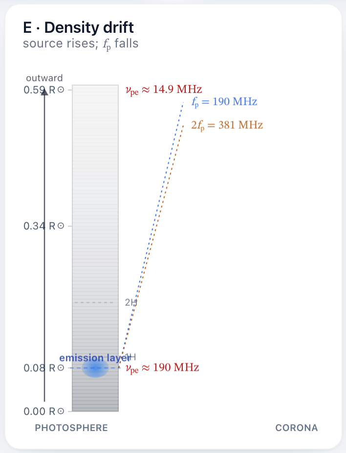
  <figcaption>Panel E: density drift</figcaption>
</figure>
```

Panel E explains why the local source frequency changes as the beam rises.

#### Step 1: Exponential Coronal Density Model

Use the simple stratified model

$$
n_e(h) = n_0 e^{-h/H},
$$

where $H$ is the density scale height. This is not a full hydrostatic derivation, but it is the standard pedagogical approximation when one wants one characteristic stratification length.

#### Step 2: Plasma Frequency as a Function of Height

The electron plasma frequency is

$$
\omega_{pe} = \sqrt{\frac{4 \pi n_e e^2}{m_e}}.
$$

Substitute the exponential density profile:

$$
\omega_{pe}(h)
=
\sqrt{\frac{4 \pi e^2}{m_e} n_0 e^{-h/H}}
=
\omega_{pe,0} e^{-h/(2H)},
$$

where

$$
\omega_{pe,0} \equiv \sqrt{\frac{4 \pi n_0 e^2}{m_e}}.
$$

Ordinary frequency is $\nu_{pe} = \omega_{pe}/2\pi$, so the same exponential dependence holds:

$$
\nu_{pe}(h) = \nu_{pe,0} e^{-h/(2H)}.
$$

That is the origin of the panel-C statement that $f_p$ drops with height.

#### Step 3: Source Motion in Time

In the explorer the beam packet is approximated as moving at nearly constant speed:

$$
h(t) = h_0 + v_b t.
$$

Insert this into the plasma-frequency profile:

$$
\nu_{pe}(t)
=
\nu_{pe,0}
\exp\!\left[-\frac{h_0 + v_b t}{2H}\right].
$$

More clearly, grouping constants,

$$
\nu_{pe}(t)
=
\nu_{pe}(h_0)\,
e^{-v_b t/(2H)}.
$$

So the local plasma frequency, and therefore the local plasma-emission frequency, decreases exponentially in time for this simple constant-speed, exponential-atmosphere model.

#### Step 4: Drift Rate

Differentiate $\nu_{pe}(h)$ with respect to time:

$$
\frac{d \nu_{pe}}{dt}
=
\frac{d \nu_{pe}}{dh}\frac{dh}{dt}.
$$

From

$$
\nu_{pe}(h) = \nu_{pe,0} e^{-h/(2H)},
$$

we get

$$
\frac{d \nu_{pe}}{dh}
=
-\frac{1}{2H}\nu_{pe}(h).
$$

Since $dh/dt = v_b$,

$$
\frac{d \nu_{pe}}{dt}
=
-\frac{v_b}{2H}\nu_{pe}(h).
$$

Thus the magnitude of the drift rate is

$$
\left|\frac{d \nu_{pe}}{dt}\right|
=
\frac{v_b}{2H}\nu_{pe}(h).
$$

This explains the main control knobs in the explorer:

- larger $v_b$ gives faster drift,
- smaller $H$ gives faster drift,
- larger local $\nu_{pe}$ gives faster absolute drift.

#### Step 5: Fundamental and Harmonic Escape

If the escaping radiation is fundamental plasma emission,

$$
\nu_F \approx \nu_{pe}.
$$

If the escaping radiation is harmonic plasma emission,

$$
\nu_H \approx 2 \nu_{pe}.
$$

Therefore,

$$
\frac{d \nu_H}{dt} \approx 2 \frac{d \nu_{pe}}{dt}.
$$

This is why the harmonic track sits above the fundamental track and has a proportionally larger absolute drift rate in frequency units, even though both arise from the same source motion.

### Panel F: Observed Signature

```{=latex}
\explorerthumb{figures/explorer-screenshots/plasma-panel-f-dynamic-spectrum.png}{Panel F: dynamic spectrum}
```

```{=html}
<figure class="explorer-thumb">
  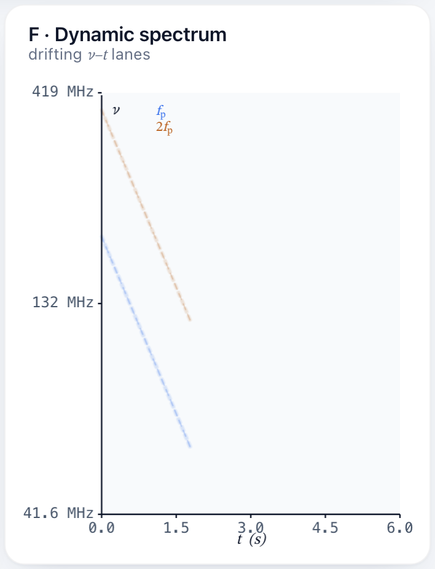
  <figcaption>Panel F: dynamic spectrum</figcaption>
</figure>
```

Panel F is intentionally drawn as a **recording** rather than as a precomputed answer. Panel E shows the instantaneous source height $h(t)$ and local escape frequencies; panel F shows the spectrogram that would be accumulated by an observer as time passes. The panel therefore teaches the mapping

$$
h(t) \rightarrow n_e(h) \rightarrow \nu_{pe}(h) \rightarrow \nu_{\mathrm{obs}}(t).
$$

That mapping is the real conceptual bridge between source physics and radio dynamic spectra.

### Plasma Preset Narratives

**Classic Type III.**  
Use this as the clean first example. The beam is fast, the source starts low enough that $\nu_{pe}$ is high, and the density gradient is steep enough that the drift is obvious. Tell students: "The slope in velocity space is the engine; the density gradient is the clock."

**Type II shock-like.**  
Use this to separate *emission mechanism* from *exciter speed*. The same plasma-emission logic applies, but the source moves more slowly and the scale height is larger, so the drift lane evolves more gradually.

**Weak impulsive.**  
Use this to emphasize that unstable free energy does not automatically guarantee a strong observed burst. The beam may be weak, the growth marginal, or the fundamental escape less efficient than the harmonic.

## ECM Emission Explorer

### Mechanism Summary

ECM is the direct-emission contrast to plasma emission. The wave is amplified by a velocity-space anisotropy and escapes near an electron-cyclotron harmonic, rather than being produced through an intermediate Langmuir-wave stage. The current explorer follows one chain:

$$
\hbox{anisotropic electrons}
\rightarrow
\hbox{cyclotron resonance}
\rightarrow
\hbox{mode growth and escape}
\rightarrow
\hbox{beamed coherent radiation}.
$$

The four panels now follow that chain in order. Panel A shows where the resonance curve intersects the favorable-gradient source proxy. Panel B explains why that resonance curve is an ellipse. Panel C turns the active overlap patch into an escaping beam cone. Panel D checks whether the plasma conditions and harmonic allow the wave to escape.

The controls separate the source, plasma, and mode physics. The loss-cone angle $\alpha_{\mathrm{lc}}$ sets the pitch-angle boundary of the source distribution. The anisotropy parameter $\xi$ sets the strength of the positive perpendicular gradient. The ratio $\omega_{pe}/\Omega_{ce}$ sets the plasma loading relative to the gyrofrequency and therefore affects both the refractive geometry and the escape window. The harmonic $s$ and mode choice select which cyclotron branch is being illustrated. The near-harmonic emission-frequency parameter $u_s=\omega/(s\Omega_{ce})$ is kept fixed near unity in the HTML, since the explorer is focused on emission close to the selected cyclotron harmonic. The frequency and brightness cards at the top are illustrative proxy values, not outputs of a full kinetic dispersion calculation.

**Assumptions and scope.** The ECM explorer is a resonance-geometry and escape-regime teaching model. Its source patches, growth factors, selected beam angles, and brightness readouts are proxies, not outputs of a full kinetic dispersion solver. Use the panels to understand which velocity-space region can feed a maser and why the density-to-field ratio controls escape; do not interpret the displayed brightness as a calibrated radiative-transfer prediction.

### Panel A: Resonance in Velocity Space

```{=latex}
\explorerthumb{figures/explorer-screenshots/ecm-panel-a-resonance-velocity.png}{Panel A: velocity-space resonance}
```

```{=html}
<figure class="explorer-thumb">
  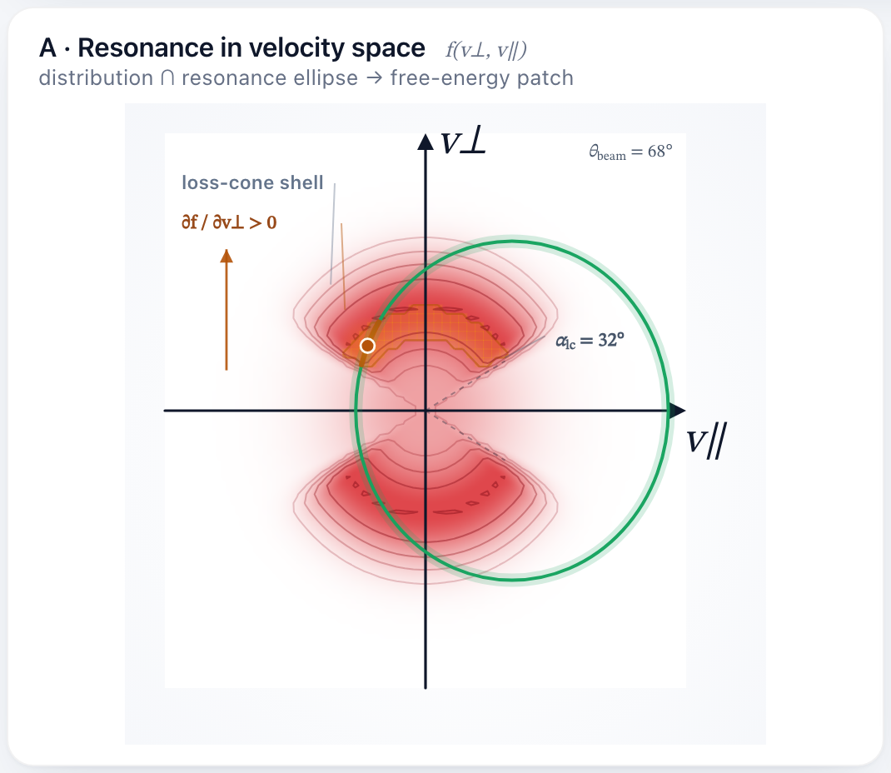
  <figcaption>Panel A: velocity-space resonance</figcaption>
</figure>
```

Panel A answers the question: *which part of the electron distribution can feed the maser?* The free energy is the region where

$$
\frac{\partial f}{\partial v_\perp} > 0.
$$

In that region, wave-driven resonant diffusion can reduce the perpendicular particle energy. The lost particle energy appears as growing electromagnetic wave energy.

For a loss-cone source, the boundary angle is set by magnetic mirroring. If the magnetic moment

$$
\mu = \frac{m_e v_\perp^2}{2B}
$$

and kinetic energy are approximately conserved, an electron mirrors where $v_\parallel \rightarrow 0$. With $B_0$ at the source and $B_m$ at the mirror point,

$$
\frac{v^2\sin^2\alpha_{\mathrm{lc}}}{B_0}
=
\frac{v^2}{B_m},
$$

so

$$
\sin^2\alpha_{\mathrm{lc}} = \frac{B_0}{B_m}.
$$

Thus $\alpha_{\mathrm{lc}}$ is a source-distribution parameter. Changing it moves the loss-cone boundary and therefore moves the velocity-space region where the shell model supplies favorable perpendicular-gradient free energy.

The resonance curve comes from the relativistic cyclotron condition

$$
\omega-k_\parallel v_\parallel = s\frac{\Omega_{ce}}{\gamma}.
$$

The left side is the wave frequency Doppler shifted into the electron guiding-center frame. The right side is the relativistically reduced gyrofrequency at harmonic $s$.

Use dimensionless coordinates

$$
x\equiv \frac{v_\perp}{c},
\qquad
y\equiv \frac{v_\parallel}{c},
\qquad
u_s\equiv \frac{\omega}{s\Omega_{ce}},
\qquad
\alpha_s\equiv \frac{k_\parallel c}{s\Omega_{ce}}.
$$

With $1/\gamma=\sqrt{1-x^2-y^2}$, the resonance condition becomes

$$
u_s-\alpha_s y = \sqrt{1-x^2-y^2}.
$$

Squaring and completing the square gives

$$
x^2
+
(1+\alpha_s^2)
\left(y-\frac{u_s\alpha_s}{1+\alpha_s^2}\right)^2
=
\frac{1+\alpha_s^2-u_s^2}{1+\alpha_s^2}.
$$

This is the ellipse drawn in Panel A. Growth is strongest where this ellipse crosses the favorable-gradient part of the source distribution. The highlighted source patch is therefore not the whole loss cone and not the whole resonance ellipse; it is their useful overlap.

The wave-normal angle $\theta_{\mathrm{beam}}$ enters only through the wavevector
component parallel to the magnetic field:

$$
k_\parallel = k\cos\theta_{\mathrm{beam}}.
$$

Using the refractive-index definition $n_s=kc/\omega$ gives the useful
re-parameterization

$$
\alpha_s
=
\frac{k_\parallel c}{s\Omega_{ce}}
=
\frac{k c\cos\theta_{\mathrm{beam}}}{s\Omega_{ce}}
=
n_s\frac{\omega}{s\Omega_{ce}}\cos\theta_{\mathrm{beam}}
=
n_s u_s\cos\theta_{\mathrm{beam}}.
$$

This step does not create the ellipse; it only says how the wave propagation
angle controls $\alpha_s$. The ellipse came from squaring the relativistic
resonance condition above. In the nearly perpendicular limit
$k_\parallel \simeq 0$, so $\alpha_s\simeq 0$, and the equation reduces to

$$
x^2+y^2=1-u_s^2,
$$

which is a circle in the $(v_\perp,v_\parallel)$ plot. Finite $k_\parallel$
shifts and compresses that circle into the general ellipse.

This is why both the near-harmonic emission frequency and $\omega_{pe}/\Omega_{ce}$ affect the selected beam angle in the resonance condition. The HTML keeps $u_s=\omega/(s\Omega_{ce})$ fixed near unity and represents the refractive part with a teaching proxy: as $\omega_{pe}/\Omega_{ce}$ increases, the proxy refractive index increases. Together these set $\alpha_s$, which changes the size and offset of the resonance ellipse. The explorer then scans candidate values of $\theta_{\mathrm{beam}}$ and selects the angle whose ellipse best overlaps the $\alpha_{\mathrm{lc}}$-controlled shell proxy while remaining in an escape-favored regime.

### Panel B: Geometric Construction

```{=latex}
\explorerthumb{figures/explorer-screenshots/ecm-panel-b-geometric-construction.png}{Panel B: geometric construction}
```

```{=html}
<figure class="explorer-thumb">
  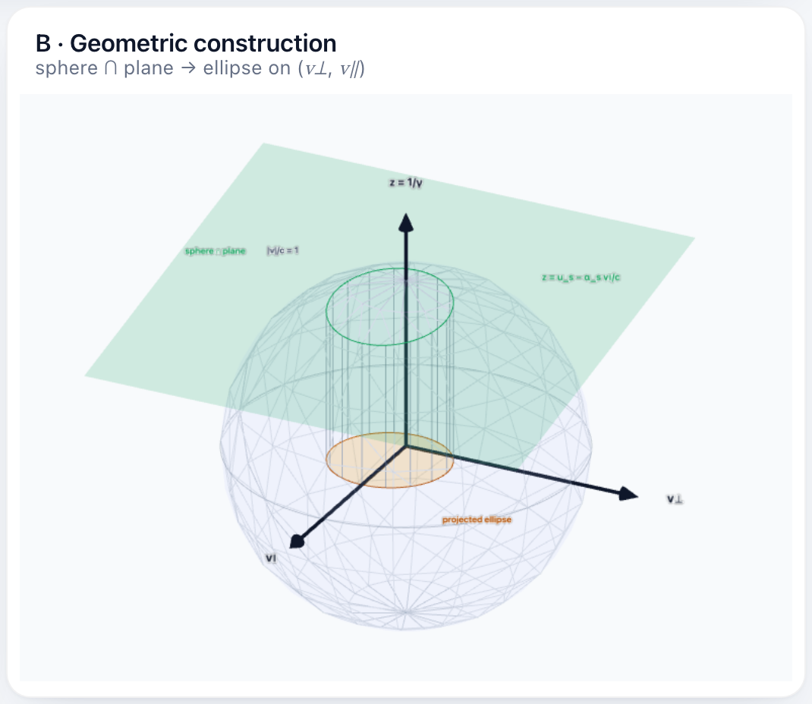
  <figcaption>Panel B: geometric construction</figcaption>
</figure>
```

Panel B shows the same resonance curve in a three-dimensional construction. Define

$$
z\equiv \frac{1}{\gamma}.
$$

The Lorentz factor identity becomes

$$
z^2 = 1-x^2-y^2,
\qquad\hbox{or}\qquad
x^2+y^2+z^2=1.
$$

Every electron maps to the unit sphere in the rescaled $(x,y,z)=(v_\perp/c, v_\parallel/c, 1/\gamma)$ space. The resonance condition adds the plane

$$
z=u_s-\alpha_s y.
$$

Resonant electrons must lie on both surfaces. A plane cuts a sphere in a circle. When that circle is projected back onto the $(v_\perp,v_\parallel)$ plane, it appears as the ellipse in Panel A.

This construction is useful because it separates the two ingredients. The unit sphere comes from relativistic mass-energy geometry. The tilted plane comes from the parallel Doppler term $k_\parallel v_\parallel$. The current HTML keeps the construction axes at a 1:1:1 scale so the sphere, plane, and projected ellipse are not visually distorted.

### Panel C: Beam Cone Geometry

```{=latex}
\explorerthumb{figures/explorer-screenshots/ecm-panel-c-beam-cone.png}{Panel C: beam cone}
```

```{=html}
<figure class="explorer-thumb">
  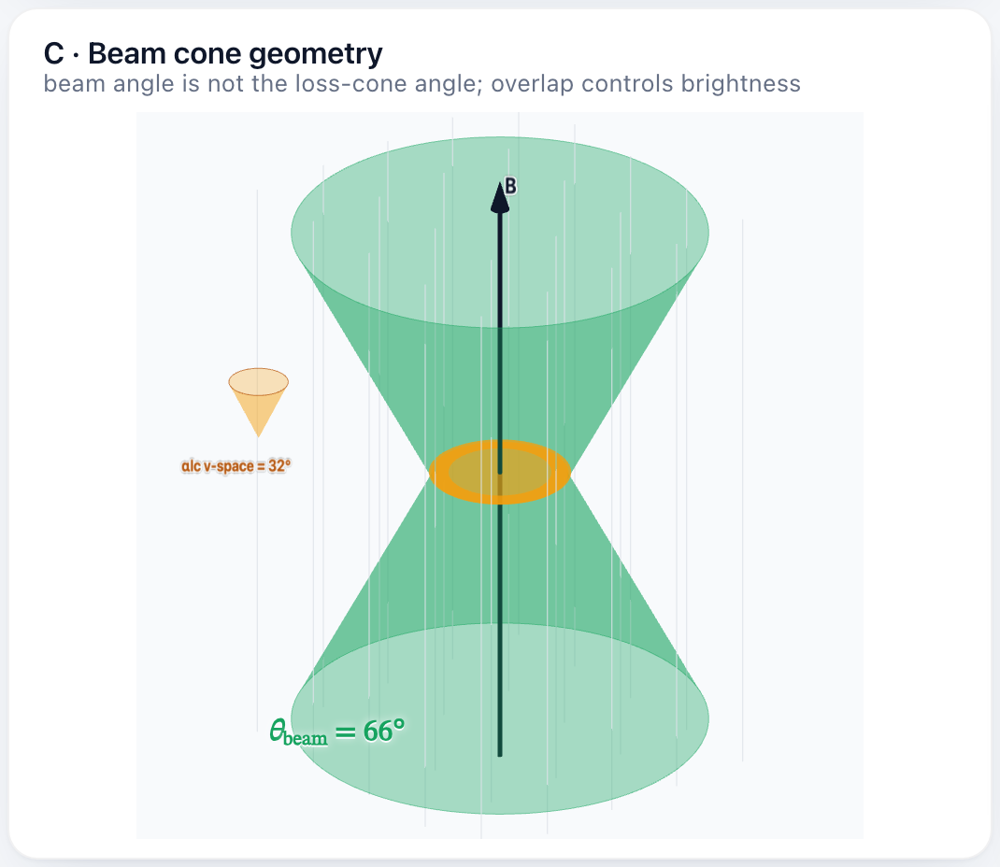
  <figcaption>Panel C: beam cone</figcaption>
</figure>
```

Panel C translates the active velocity-space patch into the angular pattern of escaping radiation. The amber ring or disk marks the active ECM source region: the resonant-overlap patch where the cyclotron-resonance curve crosses the favorable-gradient part of the modeled source distribution. Wave growth is launched from that source region.

The translucent green shape is a hollow beam cone around the magnetic-field direction. Its opening angle is $\theta_{\mathrm{beam}}$, the wave-normal angle selected by the overlap calculation. In the current HTML, the cones begin at the source ring and extend outward along $+\mathbf{B}$ and $-\mathbf{B}$; the parts that would lie on the wrong side of the source are clipped away. This is why the beam originates from the ring rather than from the axis center.

The panel uses the following division of roles:

$$
\begin{aligned}
\alpha_{\mathrm{lc}}
&\;\hbox{sets the loss-cone boundary and source proxy in velocity space},\\
\frac{\omega_{pe}}{\Omega_{ce}}
&\;\hbox{sets the refractive and cutoff environment},\\
\theta_{\mathrm{beam}}
&\;\hbox{is the selected escaping wave-normal angle}.
\end{aligned}
$$

The small amber $\alpha_{\mathrm{lc}}$ cone is an inset reminder of the source pitch-angle boundary. It is drawn with a different shade because it is not the escaping radiation cone. The faint vertical grid is a set of background magnetic field lines; the heavy central arrow names the local $\mathbf{B}$ direction used to define both $\alpha_{\mathrm{lc}}$ and $\theta_{\mathrm{beam}}$.

The important reading is that $\alpha_{\mathrm{lc}}$ and $\theta_{\mathrm{beam}}$ live in different spaces, so there is no direct identity such as $\theta_{\mathrm{beam}}=\alpha_{\mathrm{lc}}$. The loss-cone angle is an electron pitch angle in velocity space:

$$
\tan\alpha_{\mathrm{lc}}
=
\frac{v_\perp}{|v_\parallel|}.
$$

It marks where the source distribution has a sharp pitch-angle boundary. In the $(x,y)=(v_\perp/c,v_\parallel/c)$ plot, that boundary is approximately a pair of pitch-angle rays,

$$
x=|y|\tan\alpha_{\mathrm{lc}}.
$$

The emitted wave angle $\theta_{\mathrm{beam}}$ enters a different part of the problem. It sets the parallel wave number

$$
k_\parallel=k\cos\theta_{\mathrm{beam}},
$$

and therefore changes the resonance ellipse through

$$
\alpha_s=\frac{k_\parallel c}{s\Omega_{ce}}
\simeq n_s u_s\cos\theta_{\mathrm{beam}}.
$$

Thus the relation between $\alpha_{\mathrm{lc}}$ and $\theta_{\mathrm{beam}}$ is an overlap condition, not a one-line equality. For a trial $\theta_{\mathrm{beam}}$, the resonance ellipse is drawn. Growth is strong only where that ellipse crosses the part of the electron distribution controlled by $\alpha_{\mathrm{lc}}$, especially the region intended to represent $\partial f/\partial v_\perp>0$.

The HTML calculation is deliberately simple. It scans trial values

$$
15^\circ \leq \theta_{\mathrm{beam}} \leq 90^\circ,
$$

draws the resonance ellipse for each trial angle, and samples 96 points around that ellipse. A sampled point contributes to the score only if it lies in the upper half of velocity space and inside the favorable-gradient source proxy. The amber shaded region in Panel A is that proxy: it marks the inner flank of the shell model used by the scoring calculation, where the distribution is intended to rise outward in $v_\perp$. It should not be read as a numerical derivative map of every pixel in the red background cloud. For the loss-cone case, the proxy condition is approximately

$$
\hbox{pitch}>\alpha_{\mathrm{lc}},
\qquad
v_0-1.1\Delta v < v < v_0-0.1\Delta v,
$$

with $v_\perp>0$. Here $v_0$ and $\Delta v$ describe the shell in the pedagogical distribution model. This distinction matters because the current loss-cone background image is drawn as a schematic depleted core, while the amber mask and overlap score use the shell-based model. The small orange segment drawn on the green ellipse is not the whole source patch. It is the subset of the resonance ellipse that lies inside the shell-inner-edge proxy. The white dot marks a representative point on this active overlap.

For a trial angle, the raw overlap score is essentially

$$
S_{\mathrm{raw}}(\theta_{\mathrm{beam}})
=
\frac{1}{96}
\sum_{k\in A(\theta_{\mathrm{beam}})}
\max\!\left[0.02,\,
f(v_{\parallel,k},v_{\perp,k})\right],
$$

where $A(\theta_{\mathrm{beam}})$ is the set of sampled ellipse points that pass the patch test. The small floor value prevents a very faint but valid overlap from scoring as exactly zero. The displayed score is then

$$
S(\theta_{\mathrm{beam}})
=
S_{\mathrm{raw}}(\theta_{\mathrm{beam}})\,
W_{\mathrm{mode}}(\theta_{\mathrm{beam}})\,
W_{\mathrm{esc}}.
$$

The mode factor is a teaching proxy for the fact that different magnetoionic modes favor different propagation directions. In the HTML it is

$$
W_{\mathrm{mode}}(\theta)=
\begin{cases}
0.35+0.65\sin^{1.4}\theta, & \hbox{X-mode},\\
0.70+0.30\cos\theta, & \hbox{O-mode},\\
0.85+0.15\sin\theta, & \hbox{both modes}.
\end{cases}
$$

Thus X-mode is biased toward more perpendicular emission, while O-mode is given a mild bias toward smaller $\theta_{\mathrm{beam}}$. The escape factor is simpler:

$$
W_{\mathrm{esc}}=
\begin{cases}
1, & \hbox{escape proxy allows growth},\\
0.25, & \hbox{escape proxy suppresses growth}.
\end{cases}
$$

Here "escape proxy allows growth" means the anisotropy is large enough and $\omega_{pe}/\Omega_{ce}$ is below the harmonic-dependent threshold shown in Panel D.

The displayed beam angle is a smoothed, score-weighted average of the best-scoring trial angles, not simply the single maximum. Changing $\alpha_{\mathrm{lc}}$ moves the source proxy; changing $\theta_{\mathrm{beam}}$ changes the resonance ellipse through $k_\parallel$. The selected $\theta_{\mathrm{beam}}$ is therefore the wave angle whose ellipse passes through the strongest usable part of the $\alpha_{\mathrm{lc}}$-controlled shell model. In Panel C, the orange ring or disk is a schematic source region corresponding to this active overlap patch. It is not a literal copy of the small orange arc in Panel A; it is the 3D beam-cone cartoon's way of saying "this is where the resonant source patch launches the escaping wave cone." This is why $\alpha_{\mathrm{lc}}$ can move the selected beam angle, but the mapping is indirect and need not be monotonic.

### Panel D: Regime and Escape

```{=latex}
\explorerthumb{figures/explorer-screenshots/ecm-panel-d-regime-escape.png}{Panel D: regime and escape}
```

```{=html}
<figure class="explorer-thumb">
  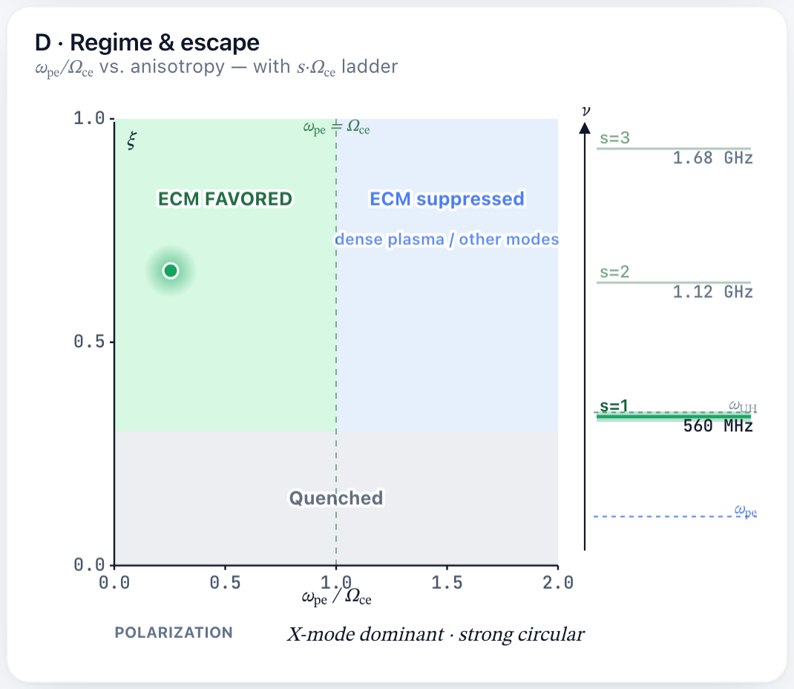
  <figcaption>Panel D: regime and escape</figcaption>
</figure>
```

Panel D asks whether the wave that grows in the source can propagate out of the plasma. The main scalar control is

$$
r\equiv \frac{\omega_{pe}}{\Omega_{ce}}.
$$

Because

$$
\omega_{pe}=\sqrt{\frac{4\pi n_e e^2}{m_e}},
\qquad
\Omega_{ce}=\frac{eB}{m_e c},
$$

the ratio scales as

$$
\frac{\omega_{pe}}{\Omega_{ce}}\propto \frac{\sqrt{n_e}}{B}.
$$

High density raises the plasma cutoff frequencies. Strong magnetic field raises the cyclotron frequency. Escape is favored when the cyclotron-harmonic emission sits on a propagating magnetoionic branch and is not blocked by the local cutoff or upper-hybrid structure.

A simple transverse-wave example shows the basic idea:

$$
k^2c^2=\omega^2-\omega_{pe}^2.
$$

If $\omega<\omega_{pe}$, then $k$ is imaginary and the wave is evanescent. In a magnetized plasma, the X and O modes have different cutoffs and resonances, so the exact boundary depends on mode, harmonic, and propagation angle. The explorer keeps this as a qualitative escape map rather than solving the full Appleton-Hartree dispersion relation.

The current HTML uses a growth-and-escape proxy. Growth requires enough anisotropy, approximately $\xi\gtrsim0.3$, and a harmonic-dependent density ratio window. The displayed thresholds are

$$
\begin{array}{c|c}
\hbox{harmonic} & \hbox{illustrative escape-favored limit} \\
\hline
s=1 & r\lesssim 1.0 \\
s=2 & r\lesssim 1.25 \\
s=3 & r\lesssim 1.4
\end{array}
$$

Higher harmonics are allowed a somewhat larger ratio in the proxy, but their growth weight is smaller. The brightness-temperature card is derived from the same proxy growth factor, so it should be read as a pedagogical indicator of coherent amplification, not as a radiative-transfer prediction.

The fundamental and higher harmonics are therefore not just copies of the same burst shifted upward in frequency. The fundamental branch sits closest to the local cyclotron scale, so it usually couples most strongly to the anisotropic electron distribution and can produce the largest maser gain. It is also the branch most vulnerable to local plasma cutoffs, mode coupling, gyroresonant absorption, and competition with nearby electrostatic or upper-hybrid structure. A higher harmonic, such as $s=2$ or $s=3$, is emitted at a larger absolute frequency for the same magnetic field, so it can lie farther above the local cutoff and escape from somewhat denser plasma. The tradeoff is that the harmonic coupling is weaker and more selective in velocity space, so the same electron anisotropy usually gives less growth. This is why changing $s$ in the explorer can move the beam angle and the escape status while also reducing the brightness proxy.

The visible jump in the resonance ellipse between $s=1$ and higher harmonics comes from the same resonance geometry, not from a change in the loss-cone distribution. The ellipse center is

$$
y_c=\frac{u_s\alpha_s}{1+\alpha_s^2},
$$

and its squared perpendicular radius is proportional to

$$
\frac{1+\alpha_s^2-u_s^2}{1+\alpha_s^2}.
$$

Thus the curve moves when either the parallel Doppler parameter $\alpha_s$ or the near-harmonic frequency ratio $u_s$ changes. Changing $s$ also changes the auto-selected $\theta_{\mathrm{beam}}$, and therefore changes $k_\parallel=k\cos\theta_{\mathrm{beam}}$ and $\alpha_s$. In the HTML proxy, higher harmonics are drawn with $u_s$ closer to unity than the fundamental. That makes the allowed contour smaller and often closer to the origin in $(v_\perp,v_\parallel)$ space. This is meant to show that harmonic ECM samples a more selective resonant velocity subset; it should not be read as a full kinetic dispersion calculation for the exact harmonic source location.

Panel D also shows the upper-hybrid frequency,

$$
\omega_{UH}^2=\omega_{pe}^2+\Omega_{ce}^2,
$$

and the cyclotron harmonic ladder $s\Omega_{ce}$. This lets students compare the local plasma scale, upper-hybrid scale, and cyclotron-emission scale on the same diagram. The polarization label summarizes which magnetoionic branch is favored in the selected mode setting.

#### Visual Script for `ecm-emission-explorer.html`

Use this explorer after the plasma-emission sequence as the direct coherent-emission case.

1. **Start with Panel A.** The source needs both perpendicular-gradient free energy and the cyclotron-resonance condition. The amber mask is a proxy for the favorable shell-inner-edge region; the orange segment on the ellipse is the important part because it satisfies both the source-proxy and resonance requirements.

2. **Move to Panel B.** The ellipse is not an arbitrary drawing. It is the projection of a circle formed by a plane cutting the relativistic mass-shell sphere.

3. **Use Panel C for beaming.** The active overlap patch launches a hollow cone of escaping wave vectors. The source angle $\alpha_{\mathrm{lc}}$ controls the velocity-space source proxy; the selected $\theta_{\mathrm{beam}}$ controls the radiation cone.

4. **Finish with Panel D.** The ratio $\omega_{pe}/\Omega_{ce}$ sets the escape environment. A strong source proxy does not guarantee an observed burst if the local cutoff and mode conditions block propagation.

The observed consequence of these four panels is narrow-band coherent emission near $s\Omega_{ce}$, with polarization set by the escaping magnetoionic mode.

### Preset Narratives

**Solar spike burst.**  
Use this as the clean first ECM case: low density, strong field, favorable $\omega_{pe}/\Omega_{ce}$, and $s=1$ emission.

**AKR-like case.**  
Use this to emphasize the extreme low-density, strong-field limit where plasma effects interfere less with the cyclotron maser.

**Stellar flare.**  
Use this to connect the same basic mechanism to stronger magnetic environments and to harmonic ECM.

## Bridge Across the Mechanisms

The most useful lecture transition is:

> Bremsstrahlung and gyro emission are the incoherent baselines: individual acceleration events radiate, and the observed spectrum is the sum over many particles. Bremsstrahlung is electric-Coulomb acceleration, while gyro emission is magnetic curvature acceleration. Plasma emission and ECM are the coherent cases: a nonthermal distribution first amplifies a wave, so the brightness can exceed thermal limits by a large factor.

Within the coherent pair, plasma emission is a beam-driven two-step route: particles first excite Langmuir waves near the plasma frequency, and nonlinear conversion then produces escaping radio waves. ECM is a direct maser route: an anisotropic distribution drives electromagnetic waves near the cyclotron frequency. So the first diagnostic question for a coherent burst is: does the characteristic frequency behave like density, or like magnetic field?

## References and Further Reading

The notes are written as teaching material rather than as a literature review, but the main formulae and approximations follow these standard sources:

- Rybicki, G. B., and Lightman, A. P. 1979, *Radiative Processes in Astrophysics*. Standard reference for specific intensity, Planck radiation, radiative transfer, synchrotron emissivity, and synchrotron self-absorption.
- Dulk, G. A. 1985, "Radio emission from the Sun and stars," *Annual Review of Astronomy and Astrophysics*, 23, 169. Practical review of solar and stellar radio emission mechanisms, including free-free, gyrosynchrotron, plasma emission, and coherent bursts.
- Dulk, G. A., and Marsh, K. A. 1982, "Simplified expressions for the gyrosynchrotron radiation from mildly relativistic, nonthermal and thermal electrons," *Astrophysical Journal*, 259, 350. Source for the commonly used mildly relativistic gyrosynchrotron fitting formulae and their validity ranges.
- Stix, T. H. 1992, *Waves in Plasmas*. Standard reference for cold-plasma dielectric response and magnetoionic wave propagation.
- Melrose, D. B. 1980, *Plasma Astrophysics*, Vols. 1--2. Detailed treatment of plasma emission, wave-particle interactions, and coherent radio processes.
- Benz, A. O. 2002, *Plasma Astrophysics: Kinetic Processes in Solar and Stellar Coronae*. Useful reference for solar radio bursts, beam-driven Langmuir waves, plasma emission, and electron-cyclotron maser contexts.
- Wilson, T. L., Rohlfs, K., and Hüttemeister, S. 2013, *Tools of Radio Astronomy*. Practical reference for radio observables, brightness temperature, antenna temperature, and radiative transfer conventions.

## Summary

- Bremsstrahlung is incoherent free-free radiation from Coulomb acceleration; $Z$, $T_e$, emission measure, and optical depth set the continuum and turnover.
- Gyro emission is incoherent magnetic radiation from gyrating electrons; $\gamma$, pitch angle, $B$, and opacity set the observed spectrum.
- Plasma emission is controlled by a beam in $v_\parallel$, Langmuir growth, and a density-gradient-controlled frequency drift.
- ECM is controlled by anisotropy in $v_\perp$, cyclotron resonance geometry, and the low-density/high-field ratio $\omega_{pe}/\Omega_{ce}$.
- The most important bridge from source physics to observation is:

$$
\text{particle distribution}
\rightarrow
\text{emission process}
\rightarrow
\text{transfer or escape}
\rightarrow
\text{observed spectrum}.
$$
